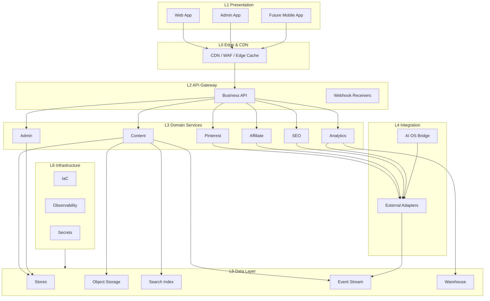

# 02 — System Layers

The website is organized into seven layers. Each layer is documented with the same template: **Purpose, Responsibilities, Owns, Never owns, AI OS APIs used, Future modules connecting.**

## Layer rules

- Dependencies point **downward only**: a layer may use the contracts of the layer below it, never the other way around.
- Cross-layer communication uses versioned contracts (see [05-api-flow.md](05-api-flow.md)), never direct database access.
- The AI OS is reachable from exactly one place: the integration layer (AI OS Bridge). Other layers may *consume AI OS outputs* indirectly through services, never by calling the AI OS themselves.
- "Never owns" items are hard boundaries, including for future features.

## Layer view

---

## L0 — Edge & CDN

- **Purpose:** Deliver content to readers worldwide with minimal latency and protect every origin from the public internet.
- **Responsibilities:**
  - TLS termination, HTTP/2/3, static asset and cache serving.
  - Web Application Firewall (WAF), bot management, and edge rate limiting.
  - Cache control for content, sitemaps, and API responses.
  - Serving sharded sitemaps and robots rules.
  - Collecting anonymized edge metrics (requests, status, latency).
- **Owns:** cache configuration, edge security policy, edge performance metrics, static artifact delivery.
- **Never owns:** business logic, content decisions, user identity, or stored user data. It never calls the AI OS.
- **AI OS APIs used:** none. Its content is already rendered and cached by the time it reaches the edge.
- **Future modules connecting:** mobile app delivery, signed URL generation for private content, edge experiments, origin shielding for regional data stores.

## L1 — Presentation

- **Purpose:** Render the user-facing surfaces of the business layer: the public website, the admin dashboard, and eventually the mobile app.
- **Responsibilities:**
  - Templates, components, layouts, and client-side behavior.
  - SEO tag rendering (title, description, canonical, structured data injection).
  - Client analytics SDK (page views, clicks, engagement) and consent management UI.
  - Affiliate disclosure rendering on every monetized surface.
  - Accessibility, performance budgets, and responsive layouts.
- **Owns:** user interface, client-side experience, metadata rendering, client instrumentation.
- **Never owns:** business rules, content generation, data beyond what the public API exposes, or any AI OS calls.
- **AI OS APIs used:** none directly. Content reaches the presentation layer as published output from `services/content-service` (or cached CDN artifacts).
- **Future modules connecting:** mobile app (reuses public API + CDN artifacts), newsletter templates, embedded embeds/widgets for syndication.

## L2 — API Gateway & Application Layer

- **Purpose:** Expose business capabilities through a small set of public, admin, and webhook APIs; orchestrate requests without containing domain rules.
- **Responsibilities:**
  - Routing, request validation, authentication/authorization enforcement, rate limiting.
  - Request composition across services (read models for the admin dashboard).
  - Receiving webhooks from Pinterest, affiliate networks, and the AI OS.
  - Idempotency handling for writes.
- **Owns:** API contracts and versioning policy, request orchestration, webhook ingestion, gateway security policy.
- **Never owns:** domain rules (delegated to services), content intelligence, business decisions, or AI OS logic.
- **AI OS APIs used:** receives AI OS content intake and status callbacks at the edge of the gateway, which are passed to the AI OS Bridge for verification and dispatch. It never reimplements any AI OS behavior.
- **Future modules connecting:** public read API for the mobile app, partner/exporter APIs, third-party content syndication endpoints.

## L3 — Domain Services (business logic)

- **Purpose:** Enforce the business rules of each bounded context (see [03-module-boundaries.md](03-module-boundaries.md)).
- **Responsibilities:**
  - Content lifecycle: intake validation, versioning, publishing, media references.
  - Pinterest: account/board management, pin scheduling, publishing, attribution metadata.
  - Affiliate: catalog ingestion, link resolution, click attribution, commission reconciliation.
  - SEO: metadata production, sitemap generation, structured data, health checks.
  - Analytics: metric definitions, report read models, dashboard data.
  - Admin: governance commands, moderation workflows, settings, audit records.
- **Owns:** domain models and workflows, business policies, the events each context emits, and its own data (schema + store).
- **Never owns:** AI intelligence (generation, orchestration, content research), other modules' data, or reader-facing presentation.
- **AI OS APIs used:**
  - Content service ← `AIOS.Content.Intake` (approved content packages) and `AIOS.Job.Status` (generation job callbacks).
  - SEO service ← `AIOS.SEO.Metadata` (keyword/meta intelligence applied as metadata, not generated here).
  - Pinterest service ← `AIOS.Pinterest.Assets` (generated pin images/copy variants).
  - Analytics service ← `AIOS.Analytics.Insights` (intelligence surfaced read-only in dashboards).
  - All calls pass through the AI OS Bridge; services never call the AI OS directly.
- **Future modules connecting:** revenue reconciliation, multilingual content, referral/community features, subscription/email digests — each as a new bounded context with the same rules.

## L4 — Integration & Adapters

- **Purpose:** Be the only layer that talks to external systems.
- **Responsibilities:**
  - AI OS Bridge: schema mapping, signature verification, job correlation, retries, circuit breaking.
  - Pinterest adapter: Pinterest API calls, per-account rate-limit budgets, token usage.
  - Affiliate adapters: network feeds, click redirection, conversion webhooks.
  - Analytics adapters: exports and provider sinks.
- **Owns:** external contract mappings, adapter resilience (retry/backoff/circuit breakers), credential usage (read from the secrets vault, never stored), and the **sole AI OS connection point**.
- **Never owns:** business decisions, content intelligence, domain rules, or any logic that mimics AI OS capabilities.
- **AI OS APIs used:** every AI OS contract, and only through the Bridge: Content Intake, Job Request/Status, SEO Metadata, Pinterest Assets, Analytics Insights.
- **Future modules connecting:** new affiliate networks, additional social platforms (if they become business channels), email/notification providers, payment/payout providers.

## L5 — Data Layer

- **Purpose:** Persist, search, cache, and analyze business data at the required scale.
- **Responsibilities:**
  - Transactional stores per service; object storage for immutable content and artifacts.
  - Search index maintained via events; cache for hot read paths.
  - Event stream as the system of record for asynchronous work (pins, clicks, metrics).
  - Analytics warehouse (columnar, partitioned) for reporting.
- **Owns:** per-service schemas, partitioning and retention policies, backups, and data lifecycle.
- **Never owns:** business logic, content intelligence, or AI OS artifacts. It stores AI OS *outputs* that the website legitimately holds (content, pin assets) but never generates them.
- **AI OS APIs used:** none. The AI OS is not a data source to this layer; integration happens at L4.
- **Future modules connecting:** time-series stores for metrics, read-model stores for new dashboards, partitioned ledger growth for pins/clicks.

## L6 — Infrastructure & Operations

- **Purpose:** Run, deploy, and observe the business layer reliably and cost-effectively.
- **Responsibilities:**
  - Infrastructure as code for environments, networking, and compute.
  - CI/CD pipelines, blue-green/canary rollout, rollback automation.
  - Observability: structured logs, metrics, traces, dashboards, SLOs.
  - Secrets management, backups, disaster recovery, scaling policies.
- **Owns:** runtime environment, deployment automation, observability, secret vault, capacity and cost controls.
- **Never owns:** application logic, domain rules, or AI OS capabilities.
- **AI OS APIs used:** none. Infrastructure for the AI OS lives in the AI OS repository.
- **Future modules connecting:** multi-region replication, edge computing functions, cost dashboards, compliance reporting pipelines.
