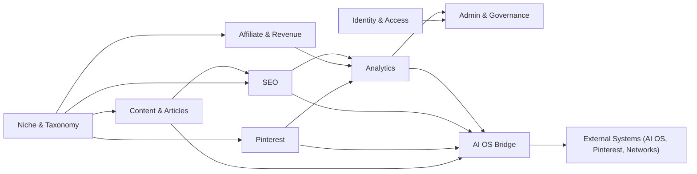

# 03 — Module Boundaries

The business layer is decomposed into bounded contexts. A module **owns** everything inside its boundary and **never** reaches outside it except through contracts. This document defines every module with the same template: **Purpose, Owns, Never owns, Depends on, Events emitted, AI OS APIs used, Future connections.**

## Boundary rules

1. **No cross-module database reads.** A module's data is private; other modules interact through APIs or events.
2. **No shared tables or shared services of record.** `libs/contracts` and pure domain types are the only shared code.
3. **Events are versioned contracts.** Consumers tolerate schema evolution (additive changes default; breaking changes require a major version).
4. **Everything is niche-scoped.** Every entity and event carries `niche_id` (and `pinterest_account_id` where relevant) so ten Pinterest accounts and multiple niches stay isolated.
5. **One AI OS door.** Only the AI OS Bridge module calls the AI OS. No other module may import, embed, or reimplement AI OS behavior.
6. **Duplication is forbidden by policy.** If a requested module looks like it would re-implement AI OS functionality, the request is rejected (root `README.md`, "No Duplicate Features").

## Module map

---

## 1. Niche & Taxonomy

- **Purpose:** Model the business structure: niches, categories, topic clusters, and per-niche site configuration.
- **Owns:** niche registry, categories, topic/tag taxonomies, per-niche settings (branding, Pinterest account binding, defaults).
- **Never owns:** article content, content generation, analytics computation, or AI OS intelligence.
- **Depends on:** nothing (foundation module).
- **Events emitted:** `taxonomy:niche-created`, `taxonomy:changed`.
- **AI OS APIs used:** none directly (may consume taxonomy suggestions later through `AIOS.SEO.Metadata`).
- **Future connections:** multilingual site variants, per-niche subdomains, community sections.

## 2. Content & Articles

- **Purpose:** Own the lifecycle of every article from intake to published, cacheable content.
- **Owns:** article records, versions/drafts, publishing state, media references, content storage blobs, per-niche routing.
- **Never owns:** generating or editing content (that is AI OS work), keyword intelligence, or SEO production (that is the SEO module's output, applied downstream).
- **Depends on:** Niche & Taxonomy, AI OS Bridge (intake), SEO module (metadata application on publish).
- **Events emitted:** `content:intake-received`, `content:published`, `content:updated`, `content:unpublished`.
- **AI OS APIs used:** `AIOS.Content.Intake` (approved content packages), `AIOS.Job.Status` (callbacks for requested jobs).
- **Future connections:** newsletter digests, related-content recommendations (rendered from existing data, never generated), mobile app content reads.

## 3. Pinterest

- **Purpose:** Operate 10+ Pinterest accounts across niches: boards, pins, scheduling, publishing, and attribution.
- **Owns:** account registry (per niche), board metadata, pin drafts/schedules, pin ledger, per-account rate-limit budgets, attribution parameters (pin/UTM metadata).
- **Never owns:** generating pin images or copy (AI OS), choosing strategy, or analyzing which pins perform (analytics module).
- **Depends on:** Niche & Taxonomy, AI OS Bridge (assets), Analytics (attribution events).
- **Events emitted:** `pin:scheduled`, `pin:published`, `pin:failed`, `pin:deleted`.
- **AI OS APIs used:** `AIOS.Pinterest.Assets` (generated pin assets and copy variants).
- **Future connections:** additional visual channels (if added as business channels), board collaboration tools, Pinterest API webhook consumers.

## 4. Affiliate & Revenue

- **Purpose:** Run the monetization surface: product catalog, affiliate links, click attribution, and commission/revenue tracking.
- **Owns:** product catalog entries, network mappings, affiliate link tokens, click ledger, commission records, disclosure metadata.
- **Never owns:** writing product copy or reviews (AI OS), pricing decisions, or forecasting (AI OS insights are display-only).
- **Depends on:** Niche & Taxonomy, external network adapters (L4), Analytics (attribution events).
- **Events emitted:** `product:ingested`, `affiliate:click`, `revenue:attributed`, `revenue:reconciled`.
- **AI OS APIs used:** `AIOS.SEO.Metadata` (metadata for product pages), optionally `AIOS.Content.Intake` for approved product descriptions.
- **Future connections:** new affiliate networks, payout providers, invoice/reporting exports, review/rating features.

## 5. SEO

- **Purpose:** Produce and maintain everything search engines consume, and report on SEO health.
- **Owns:** metadata application (titles, descriptions, canonicals), sharded sitemaps, robots rules, structured data (JSON-LD), URL policy, performance budgets, SEO health reports.
- **Never owns:** writing content, keyword research/insight generation (AI OS), or ranking decisions.
- **Depends on:** Content & Articles, Niche & Taxonomy, Analytics (crawl/traffic data).
- **Events emitted:** `seo:sitemap-rebuilt`, `seo:health-report-ready`, `seo:url-changed`.
- **AI OS APIs used:** `AIOS.SEO.Metadata` (intelligence it applies to pages), `AIOS.Analytics.Insights` (display-only recommendations).
- **Future connections:** multilingual hreflang handling, site search improvements, crawl API integrations.

## 6. Analytics

- **Purpose:** Define, collect, compute, and serve the business metrics the whole site runs on.
- **Owns:** event schema, collection pipeline, warehouse (partitioned), metric definitions (KPIs), report read models, dashboard data APIs.
- **Never owns:** making predictions or generating insights (AI OS), business decisions, or other modules' data.
- **Depends on:** events from Content, Pinterest, Affiliate, and SEO; Niche & Taxonomy for scoping.
- **Events emitted:** none outward (it consumes events); produces read models and scheduled reports.
- **AI OS APIs used:** `AIOS.Analytics.Insights` (intelligence surfaced read-only in dashboards).
- **Future connections:** mobile app analytics, email/notification attribution, deeper channel reporting.

## 7. Admin & Governance

- **Purpose:** Give operators the tools to run the business: review, approve, moderate, schedule, and configure.
- **Owns:** admin UX flows (via `apps/admin`), moderation/approval workflows, scheduled jobs UI, audit log, business settings.
- **Never owns:** automatic decision-making beyond explicitly configured rules, content intelligence, or AI OS automation.
- **Depends on:** every domain service (via commands), Identity & Access, Analytics (read models).
- **Events emitted:** `admin:command-executed`, `admin:approved`, `admin:settings-changed` (audit stream).
- **AI OS APIs used:** none directly; it displays AI OS-provided insights through the Analytics module.
- **Future connections:** notification/approval channels (email, Slack), export pipelines, role-based delegation.

## 8. Identity & Access

- **Purpose:** Manage who can operate the business layer.
- **Owns:** admin identities, roles/permissions (RBAC), sessions, MFA, API keys for admin automation.
- **Never owns:** reader identities beyond consent-driven essentials, content, or business logic.
- **Depends on:** nothing (security foundation).
- **Events emitted:** `iam:login`, `iam:permission-changed` (audit stream).
- **AI OS APIs used:** none.
- **Future connections:** reader accounts (if reviews/favorites are added), SSO with business providers.

## 9. AI OS Bridge (integration module)

- **Purpose:** Be the single, verifiable doorway between the business layer and the AI Brain.
- **Owns:** AI OS API adapters, schema mapping, signature verification, job correlation IDs, retry/backoff and circuit breaking, AI OS credential usage.
- **Never owns:** any AI OS intelligence, any business rule, or any behavior that could be mistaken for AI OS functionality.
- **Depends on:** nothing internal (it adapts external contracts for services).
- **Events emitted:** `bridge:intake-verified`, `bridge:delivery-failed`.
- **AI OS APIs used:** **all of them, exclusively here**: Content Intake, Job Request/Status, SEO Metadata, Pinterest Assets, Analytics Insights.
- **Future connections:** any new AI OS capability is added as a contract here — never as a new module elsewhere.

---

## Boundary contract summary

| Boundary | Rule |
|----------|------|
| Website ↔ AI OS | Only through the AI OS Bridge; never embed or duplicate AI OS code |
| Module ↔ module | APIs/events only; no shared databases |
| Module ↔ external | Only through L4 adapters; credentials from the vault |
| Data layer | Per-service schemas; niche-scoped partitions |
| Presentation | Reads published output; never business logic |
