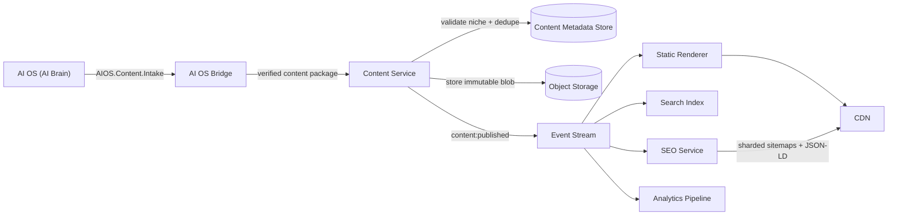
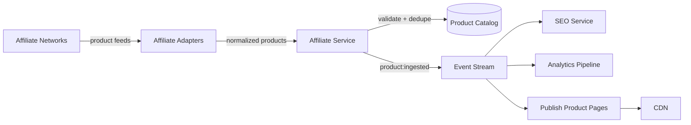
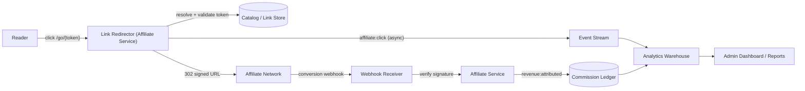
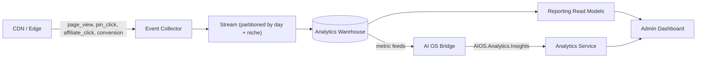
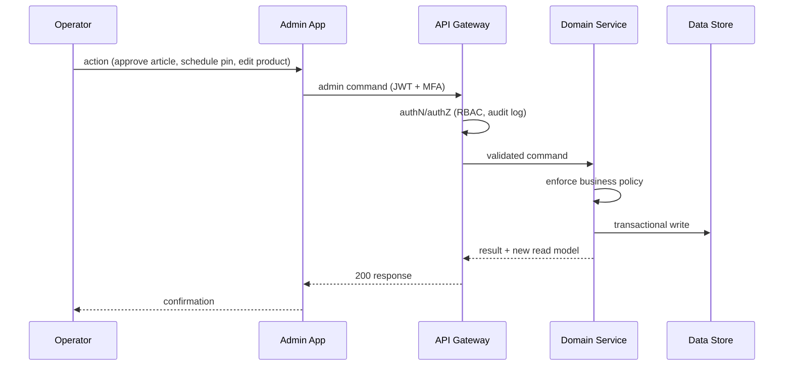

# 04 — Data Flow

This document describes the primary data flows of the business layer. Flows are asynchronous wherever the reader's request does not need the result. All events carry `niche_id` (and `pinterest_account_id` where relevant) so data can be partitioned and reported per niche/account.

## Flow 1 — Article publishing (AI OS → website)

The AI Brain produces approved content; the website validates, stores, renders, and ships it to readers. The website never generates content.

1. AI OS delivers an approved content package (body, title, media, niche, publish metadata) to the AI OS Bridge.
2. The Bridge verifies the signature, maps the payload to the internal contract, and passes it to the Content Service.
3. The Content Service validates niche scope, dedupes (content hash), stores metadata transactionally and the content blob immutably in object storage.
4. A `content:published` event fans out to the renderer, search index, SEO service, and analytics pipeline.
5. The renderer produces static, cacheable artifacts; the SEO service regenerates the affected sitemap shard and structured data; both land on the CDN.

## Flow 2 — Pin lifecycle (AI OS assets → Pinterest)

```mermaid
flowchart LR
    BRIDGE["AI OS Bridge"] -->|"AIOS.Pinterest.Assets"| PS["Pinterest Service"]
    PS -->|"create pin draft per account/board"| Q["Pin Queue (per account)"]
    Q -->|"rate-limit-aware publish"| PA["Pinterest API"]
    PA -->|"pin_id + permalink"| LEDGER[("Pin Ledger")]
    LEDGER -->|"pin:published"| EV["Event Stream"]
    EV --> ATT["Attribution (pin params + UTM)"]
    ATT --> ANA["Analytics Pipeline"]
```

1. The Pinterest Service requests pin assets (images/copy variants) from the AI OS via the Bridge — assets are generated by the AI Brain, never here.
2. Pins are enqueued per account with board and scheduling metadata; each account has its own rate-limit budget.
3. A worker publishes at the scheduled time, records `pin_id` and the permalink in the append-only pin ledger, and emits `pin:published`.
4. Attribution data (pin ID, account, niche, UTM params) flows into analytics so every pin's contribution is measurable.

## Flow 3 — Affiliate product ingestion

1. Network feeds (and future API-based feeds) are normalized by adapters into one catalog contract.
2. The Affiliate Service validates, dedupes, and enriches products; new or changed products emit `product:ingested`.
3. Product pages are rendered and cached, SEO metadata is applied, and analytics begins tracking product page traffic.

## Flow 4 — Affiliate click and revenue

1. Every affiliate link is a signed token (`/go/{token}`) so clicks can be attributed, deduped, and rate-limited.
2. The redirector logs an async click event, then 302s the reader to the network URL.
3. Networks report conversions via signed webhooks; the Affiliate Service reconciles them into the commission ledger.
4. Clicks and commissions both land in the analytics warehouse for revenue reporting.

## Flow 5 — Analytics pipeline

1. Client and edge events (page views, clicks, conversions) are collected asynchronously; the request path never blocks on analytics.
2. Events flow into a partitioned stream and then into a columnar warehouse partitioned by day and niche.
3. Reporting read models power dashboards; optionally, metric feeds are sent to the AI OS so the AI Brain can return insights — which the website displays read-only.

## Flow 6 — Admin command

Admin commands are always authenticated, authorized, and written to the audit log before they touch any domain state.

## Data ownership table

| Data domain | Owner | Primary store | Scale design |
|-------------|-------|---------------|--------------|
| Articles & content blobs | Content | Object storage + metadata store | Immutable blobs; metadata partitioned by niche |
| Niches, categories, settings | Taxonomy | Relational store | Small; hot-cached |
| Pinterest accounts, boards, pins | Pinterest | Append-only pin ledger + account store | Ledger partitioned by account + date |
| Products, links, clicks | Affiliate | Relational store + click ledger | Click ledger partitioned by month/niche |
| SEO artifacts | SEO | Generated files + state store | Sitemaps sharded (`sitemap-00001.xml.gz` …) |
| Events | Analytics | Stream + warehouse | Partitioned by day + niche; retention policy |
| Commissions/revenue | Affiliate | Commission ledger | Append-only; reconciled nightly |
| Audit log | Admin | Append-only store | Immutable; retention by compliance policy |

## Storage principles

1. **One store, one owner.** No shared tables; each owner's schema is private.
2. **Append-first for high volume.** Pin ledgers, click ledgers, and audit logs are append-only and partitionable — the foundation for millions of pins and clicks.
3. **Content is immutable.** Published articles are versioned blobs; updates create new versions, never destructive edits.
4. **Reads are cached.** Reader-facing reads come from CDN/cache; services are not on the hot path for static content.
5. **Warehouse is derived.** The analytics warehouse is rebuilt from the event stream; it is never a source of truth for transactional state.
