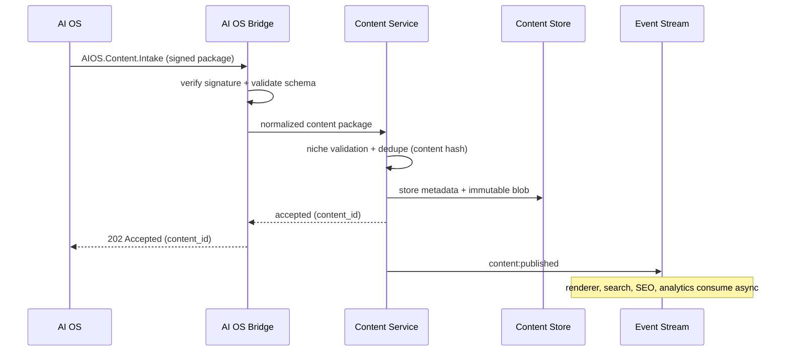
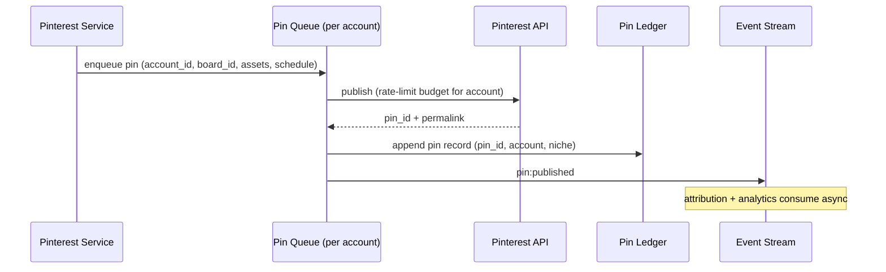
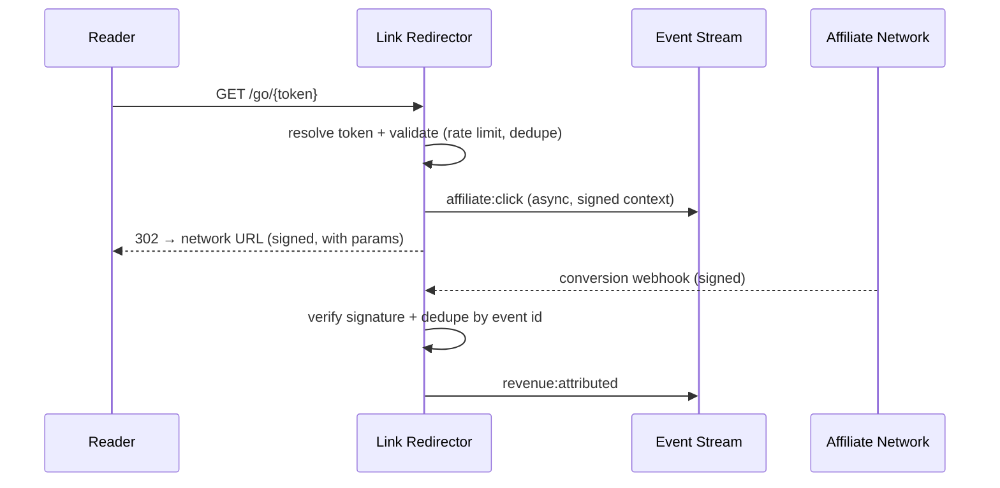

# 05 — API Flow

This document defines the API classes, contract governance, and the primary API sequence flows of the business layer.

## 1. API classes

| Class | Consumers | Auth | Examples |
|-------|-----------|------|----------|
| Public read API | Web app, future mobile app, crawlers | Read-only; cacheable; signed URLs for non-public content | `GET /api/v1/articles/{slug}`, `GET /api/v1/products/{slug}` |
| Admin API | Admin app, automation scripts | JWT + RBAC + MFA, audit-logged | `POST /api/v1/admin/articles/{id}/approve` |
| Webhook receivers | Pinterest, affiliate networks, AI OS | Signature verification (HMAC) + nonce replay protection | `POST /webhooks/pinterest/...`, `POST /webhooks/networks/...`, `POST /webhooks/aios/...` |
| AI OS Bridge | AI OS only | mTLS + signed payloads | `AIOS.Content.Intake`, `AIOS.Job.Status` |
| Internal events | Services (async) | Network policy + schema validation | `content:published`, `pin:published`, `affiliate:click` |

### Routing rules

- Reader traffic → CDN → cached content. Dynamic API calls only when cache cannot serve.
- Admin traffic → Admin API (never mixed with the public surface).
- Webhooks → dedicated receivers with signature verification before any processing.
- Internal events → stream, consumed by owner services only.

## 2. Contract governance

- **Contracts live in `libs/contracts`** as OpenAPI (sync) and AsyncAPI (events) schemas. They are reviewed like code and versioned semantically.
- **Versioning:** `v1` paths; additive changes are backwards-compatible; breaking changes require a deprecation window and a major version.
- **Idempotency:** all admin writes accept an `Idempotency-Key`; duplicate webhook deliveries are deduped by event ID.
- **Failure contract:** services return structured errors (`problem+json` style) with stable error codes; webhooks acknowledge fast and process asynchronously.
- **Schema evolution:** consumers tolerate new optional fields; events use an envelope with `type`, `version`, `niche_id`, `occurred_at`, `id`.

## 3. AI OS integration contracts (provisional names)

The website consumes AI OS outputs; it never implements the intelligence behind them. These names must be mapped to the existing AI OS API surface during integration design.

| Contract | Direction | Semantics |
|----------|-----------|-----------|
| `AIOS.Content.Intake` | AI OS → Bridge | Approved content packages (articles, product descriptions) |
| `AIOS.Job.Request` | Bridge → AI OS | Request generation jobs (e.g., pin assets for scheduled pins) |
| `AIOS.Job.Status` | AI OS → Bridge | Job lifecycle callbacks (queued, done, failed) |
| `AIOS.SEO.Metadata` | AI OS → Bridge | Keyword/meta intelligence applied by the SEO service |
| `AIOS.Pinterest.Assets` | AI OS → Bridge | Generated pin images and copy variants |
| `AIOS.Analytics.Insights` | AI OS → Bridge | Insights surfaced read-only in dashboards |

Every contract is: versioned, signed, correlated by job ID, retried with backoff, and circuit-broken on failure so the website never blocks readers because the AI Brain is slow.

## 4. Sequence — article publish (AI OS intake)

## 5. Sequence — pin publish

## 6. Sequence — affiliate click attribution

## 7. API security summary

| Concern | Control |
|---------|---------|
| Public reads | Cacheable, no PII in payloads, signed URLs for restricted content |
| Admin writes | JWT + RBAC + MFA, audit log, idempotency keys |
| Webhooks | HMAC signatures, nonce/event-id replay protection, fast-ack async processing |
| AI OS bridge | mTLS, signed payloads, job correlation IDs, circuit breakers |
| Abuse | Per-key rate limits, bot management at edge, link-token abuse detection |
| Secrets | Never in requests or logs; credentials resolved from the vault only |

Full details in [07-security-boundaries.md](07-security-boundaries.md).
