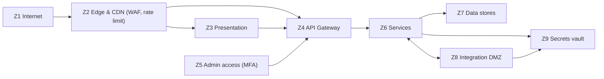

# 07 — Security Boundaries

## 1. Trust zones

| Zone | Contents | Trust level | Exposure |
|------|----------|-------------|----------|
| Z1 — Internet | Readers, crawlers, bots, attackers | Untrusted | Full |
| Z2 — Edge & CDN | CDN, WAF, bot management, edge cache | Semi-trusted (hardened) | Full |
| Z3 — Presentation | Web app, admin app rendering | Semi-trusted | Z2 only |
| Z4 — API Gateway | Public API, admin API, webhook receivers | Trusted (hardened) | Z2/Z3 |
| Z5 — Admin access | Operator identities, sessions, MFA | Trusted, individually audited | Z4 |
| Z6 — Services | Domain services, AI OS Bridge, adapters | Trusted | Z4 only (no public exposure) |
| Z7 — Data stores | Databases, object storage, search, warehouse | Trusted | Z6 only |
| Z8 — Integration DMZ | AI OS, Pinterest, affiliate network connectivity | External, contract-verified | Z6 only |
| Z9 — Secrets vault | Credentials, API keys, Pinterest tokens | Highest trust | Z6/Z8 runtime only |

## 2. Boundary controls

| Boundary | Controls |
|----------|----------|
| Z1 → Z2 | TLS everywhere, WAF rules, bot management, edge rate limiting, DDoS protection |
| Z2 → Z3/Z4 | Only 443; origin restricted to CDN egress; no direct public reach of services |
| Z4 → Z6 | Service network isolation, mTLS between services, per-service least-privilege identities |
| Z6 → Z7 | Network policy: each service reaches only its own store; encrypted at rest |
| Z6 ↔ Z8 | mTLS to AI OS, signed webhooks (HMAC + replay protection), allowlisted Pinterest/network endpoints, SSRF controls |
| Z9 | Vault access is short-lived and audited; credentials never appear in logs or payloads |

## 3. Threat model (summary)

| Threat | Target | Control |
|--------|--------|---------|
| XSS via article content | Readers | Sanitize content at intake, Content-Security-Policy, strict output encoding |
| Affiliate click fraud / stuffing | Revenue | Signed link tokens, per-IP/device rate limits, dedupe by token + fingerprint, anomaly monitoring |
| Webhook spoofing | Pinterest, networks, AI OS | HMAC signatures, event-ID dedupe, nonce replay protection, allowlisted senders |
| Pinterest token theft | 10+ accounts | Per-account tokens in the vault, least-scope Pinterest apps, rotation policy, audit logging |
| Admin account takeover | Operators | MFA required, RBAC, session hardening, audit log, alerting on anomalies |
| SSRF via affiliate/product URLs | Internal network | URL allowlist + scheme validation at the resolver, no internal address resolution |
| Data exfiltration of analytics PII | Readers | Minimize collection, pseudonymize, retention limits, no PII in static content or CDN logs |
| Supply chain (dependencies) | Services | Locked dependencies, vulnerability scanning in CI, minimal runtime images, MIT-compatible policy |
| DDoS / scraping | Availability | CDN + WAF + rate limits, cache-first architecture, bot detection at edge |

## 4. Secrets management

- **Nothing secret in code or git.** `.env` and key material are ignored; only references exist in `infra/config`.
- **One vault** (Z9) holds: AI OS API credentials, per-Pinterest-account tokens, affiliate network keys, webhook signing secrets, database credentials.
- **Least privilege and rotation:** each service receives only the secrets it needs; Pinterest tokens are scoped per app/account and rotated on a schedule.
- **Audit:** every secret read is logged; revoked credentials are detected and alerted.

## 5. Data classification and privacy

| Class | Examples | Handling |
|-------|----------|----------|
| Public content | Articles, product pages, sitemaps | Cacheable; sanitized; no personal data |
| Business operational | Niche config, catalog, pin ledger, audit log | Access-controlled (Z6/Z7); encrypted at rest |
| Analytics | Events, click/revenue metrics | Pseudonymized; partitioned; retention policy by metric |
| Personal (minimal) | Consent choice, opt-out state | Stored only when required; never in CDN logs or static output |
| Credentials | API keys, tokens | Vault only (Z9) |

Privacy requirements (consent management, disclosure compliance, deletion/export obligations) are first-class architecture constraints: the event schema and consent store are designed for them from the start.

## 6. Compliance and disclosure

- **Affiliate disclosure** is rendered on every monetized surface and enforced by templates, not by author discipline.
- **Consent** is captured at the edge/presentation layer before analytics collection begins.
- **Retention limits** are defined per data class; warehouses and ledgers enforce them by partition lifecycle.
