# 08 — Deployment Strategy

## 1. Environments

| Environment | Purpose | Data | Promotion |
|-------------|---------|------|-----------|
| `dev` | Local/feature development | Synthetic, seeded fixtures | Automatic on PR branch |
| `staging` | Integration testing, release candidates | Anonymized snapshot | From `main` after merge |
| `prod` | Readers and operators | Production | Blue-green from staging RC |

- Environments are provisioned from the same IaC; only variable values differ.
- Production is reachable only through the CDN edge; services have no public ingress.

## 2. Delivery model

The architecture splits into two deployment tracks:

1. **Content track (CDN-first):** articles, product pages, sitemaps, and static assets are rendered into immutable artifacts and deployed to the CDN. Reader traffic almost never touches application compute.
2. **Application track (services):** domain services, the API gateway, admin app, and background workers are deployed as containers with infrastructure as code.

## 3. CI/CD pipeline

```mermaid
flowchart LR
    CH["Commit to feature branch"] --> CI["CI: lint + unit tests"]
    CI --> CA["Contract/schema validation"]
    CA --> SA["Security scan (deps, secrets, images)"]
    SA --> ST["Deploy to dev + e2e tests"]
    ST --> MR["Pull request review"]
    MR --> M["Merge to main"]
    M --> RC["Build release candidate"]
    RC --> SG["Deploy staging + load tests"]
    SG --> RO["Rollout prod (blue-green / canary)"]
    RO --> OBS["Observability gates (SLOs)"]
    OBS -->|"gate fail"| RB["Auto-rollback"]
```

- Every change passes lint, unit tests, contract validation, and security scanning before review.
- Staging runs a representative load test (sitemap rebuilds, pin publish bursts, analytics ingestion) before production rollout.
- Rollouts are blue-green for services and canary for edge behavior; rollback is automated on SLO breach.

## 4. Runtime and scaling

| Component | Scaling model |
|-----------|---------------|
| Static content / sitemaps | CDN; artifact generation scaled horizontally via queue workers |
| API gateway | Stateless, autoscaled by request rate |
| Domain services | Horizontally scaled; no affinity state (state lives in stores) |
| Pin publishing | Per-account queues with independent rate-limit budgets; worker pool sized per account |
| Sitemap generation | Sharded jobs (`sitemap-00001.xml.gz` …), each shard an independent job |
| Analytics ingestion | Stream with partitioned consumers; warehouse partitions by day + niche |
| Search index | Rebuilt from the event stream; index shards per niche |
| Stores | Partitioned by niche/date; read replicas and cache for hot paths |

### Scale notes

- **Millions of articles:** immutable content blobs + metadata stores partitioned by niche; static rendering keeps compute off the reader path; sitemaps are sharded, never one file.
- **Millions of pins:** append-only pin ledger partitioned by account + date; per-account publish queues prevent Pinterest rate-limit blowups; attribution metadata rides the same event pipeline as analytics.
- **Ten Pinterest accounts / multiple niches:** everything is niche/account-scoped at the data, queue, token, and reporting layers; adding an account is configuration, not architecture.
- **Future mobile app:** reads the public API through the same CDN; signing and rate limits extend existing patterns; no new business logic in the client.

## 5. Observability

- **Logs:** structured, correlated by request/job ID; no secrets or personal data.
- **Metrics:** request latency, error rate, cache hit ratio, queue depth per Pinterest account, pipeline lag, warehouse load.
- **Traces:** reader requests, publish pipelines, pin jobs, webhook processing.
- **Dashboards and SLOs:** reader availability/latency, publish freshness, analytics lag (time-to-dashboard), revenue data completeness.
- **Alerting:** on-call alerts for SLO breaches, queue starvation, webhook failures, and secret-related events.

## 6. Backup and disaster recovery

- **Stores:** nightly snapshots + point-in-time recovery where supported; object storage versioned.
- **Ledgers (pins, clicks, commissions, audit):** append-only; replicas in a second region for durability.
- **Restore drills:** quarterly, including a full staging rebuild from production backups.
- **RTO/RPO targets:** defined per data class (e.g., operational data recovered within hours; public content recoverable from CDN + object storage).

## 7. Cost posture

- CDN-first delivery keeps compute spend proportional to *changes*, not traffic.
- Autoscaling and per-account worker pools bound compute; warehouse and search are partitioned so queries scan only relevant shards.
- Cost dashboards in the admin suite track spend per niche/account, aligned with revenue attribution.

## 8. Release discipline

- Releases are small, frequent, and reversible; feature flags gate behavior changes.
- Every user-facing change updates `CHANGELOG.md` under `Unreleased` before release.
- Architecture changes update this document set and are reviewed before any implementation commit (root `README.md`, Development Rules).
