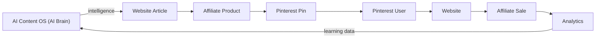

# Website Architecture Contract

**Status:** Binding baseline — must be ratified before any implementation (Task 3) begins
**Version:** 1.0
**Applies to:** `atozproducthub-website` (the business layer only)
**Counterpart:** Universal AI Content Operating System (AI OS) — separate system, separate repository

## 1. The Locked Statement

> The website is a business platform only. All intelligence belongs to the Universal AI Content Operating System. The website will never duplicate AI OS functionality.

This single sentence is the highest-level architectural rule of this repository. Every layer, module, document, pull request, and future feature must be consistent with it. If a change conflicts with this statement, the change is rejected — regardless of business pressure.

## 2. Why this contract exists

- Keep the boundary between the website and the AI OS permanent and unambiguous.
- Give every reviewer one simple test: **"Is this business display, or AI intelligence?"**
- Protect the closed loop, which is the platform's core strength.
- Survive team changes, scope creep, and pressure to "just ship it" by making the rule explicit and binding.
- Guarantee the website stays fast, simple, secure, and reviewable — because it never grows intelligence machinery.

## 3. The Closed Loop

The business runs on one loop. The AI OS learns and produces intelligence; the website is the visible surface that publishes, serves, and measures it.

### Role of each node

| Node | Role |
|------|------|
| AI Content OS | Learns, researches, and produces all intelligence (starts and ends the loop) |
| Website Article | Displays approved content the AI OS produced |
| Affiliate Product | Displays AI OS-selected products on the storefront |
| Pinterest Pin | Publishes AI OS-generated pin assets to Pinterest accounts |
| Pinterest User | Arrives on the website from a pin |
| Website | Converts the visit into traffic, engagement, and clicks |
| Affiliate Sale | Generates revenue through attributed links |
| Analytics | Measures the loop and feeds learning data back to the AI OS |

**Rule:** the loop begins and ends with AI OS learning. The website is a node in the middle — it never becomes a generation or learning node.

## 4. Locked Boundaries

### 4.1 The website owns — business layer only

| Area | What this means here |
|------|----------------------|
| CMS | Articles, versions, publishing workflow, media references |
| Business | Niches, catalog, settings, operator workflows |
| SEO | Metadata application, sitemaps, structured data, URL policy |
| Pinterest landing pages | Pin destinations, account/board operations, pin scheduling |
| Affiliate storefront | Products, link tokens, click attribution, disclosures |
| Analytics | Event collection, metrics, reports |
| Revenue dashboard | Commission and revenue reporting |
| Admin panel | Operations, moderation, automation scheduling (business workflows only) |

### 4.2 The website NEVER contains

| Prohibited | Why |
|------------|-----|
| ❌ AI Writer | Content generation is AI OS work |
| ❌ AI Image Generator | Image generation is AI OS work |
| ❌ AI Learning | Learning lives in the AI OS |
| ❌ AI Research | Research lives in the AI OS |
| ❌ AI Memory | Memory lives in the AI OS |
| ❌ Prompt System | Prompts are AI OS machinery |
| ❌ Model Router | Routing models is AI OS machinery |
| ❌ LLM Calls | Any direct model API call from the website is forbidden |

Also prohibited, for the same reason: model weights/checkpoints, training or fine-tuning pipelines, dataset curation for models, generation endpoints, semantic/embedding services, and autonomous decision intelligence.

**"Never" is absolute.** The website may *request* generation through the AI OS Bridge and *display* the approved results. It never performs generation itself.

### 4.3 The AI OS owns — intelligence layer (listed only to mark the boundary)

Research · Topic selection · Writing · Images · SEO generation · Pinterest pin generation · Affiliate product selection · Learning · Automation

All of this lives in the AI OS repository. Nothing in it may be copied, imported, or reimplemented in this repository.

## 5. The Only Door — AI OS Bridge

- All communication between the website and the AI OS happens exclusively through the AI OS Bridge with versioned contracts (see [05-api-flow.md](05-api-flow.md)).
- The website never: calls LLM/model APIs directly, stores prompts, routes models, embeds AI OS code, or reads AI OS internals.
- The AI OS never: renders pages, holds website data, or runs the business layer.

## 6. Checklist for every future design and PR

| Question | If yes, then |
|----------|--------------|
| Does this feature display, publish, measure, or operate? | It belongs to the website |
| Does this feature generate, learn, research, or decide intelligently? | It belongs to the AI OS — integrate via the Bridge |
| Does it import or copy AI OS code? | **Forbidden** |
| Does it call any model/LLM API directly? | **Forbidden** |
| Does it store prompts, model weights, or training data? | **Forbidden** |
| Does it persist AI OS outputs as approved content via intake contracts? | Allowed — this is the normal flow |

## 7. Amendment Process

- The contract changes only through an explicit amendment: an Architecture Decision Record, reviewed, versioned, recorded in `CHANGELOG.md`, and ratified by the Lead Software Architect.
- No implementation of a new capability may begin until that capability passes the Section 6 checklist.
- An amendment that weakens the locked statement in Section 1 requires unanimous sign-off from the repository owner.

## 8. Ratification

This contract must be ratified by the Lead Software Architect and the repository owner **before any implementation begins**. Until ratified, this repository remains documentation-only.

## 9. Reference documents

- [README.md](../architecture/README.md) — architecture overview and scale targets
- [02-system-layers.md](02-system-layers.md) — layer ownership and AI OS contact per layer
- [03-module-boundaries.md](03-module-boundaries.md) — module ownership and the AI OS Bridge module
- [05-api-flow.md](05-api-flow.md) — AI OS integration contracts
- [06-responsibilities.md](06-responsibilities.md) — business-layer responsibility areas
- Root `README.md` — "No Duplicate Features" policy
