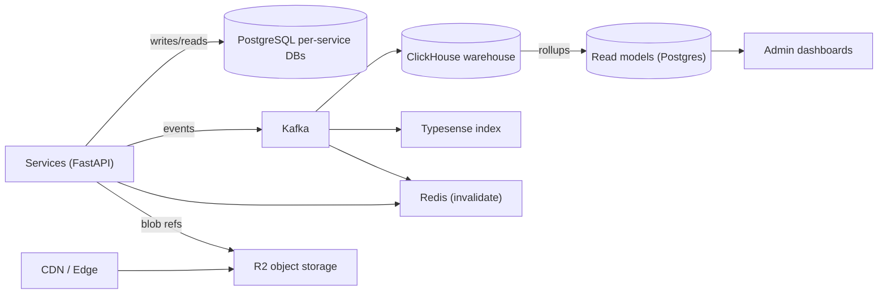
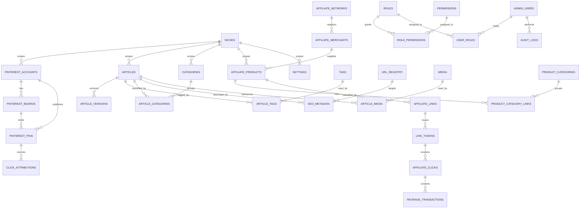

# 11 — Database Architecture (Permanent Production Database Blueprint)

**Status:** Permanent blueprint — binding for all future implementation
**Version:** 1.0
**Compliance:** Must satisfy the [Website Architecture Contract](09-website-architecture-contract.md), the [Folder Blueprint](01-folder-structure.md), and the [Technology Stack](10-technology-stack.md)

This document is the **single source of truth** for the production database architecture of the business layer. It defines stores, every table, tenancy isolation, and all operational strategies. No SQL, code, or migrations are included — this is a design blueprint only.

---

## 1. Database Philosophy

1. **Business data only.** This database stores business-layer data. It never stores AI OS internals: no prompts, model weights, training data, embeddings, inference logs, or AI memory. Approved AI OS *outputs* (published articles, pin asset references, SEO metadata) are business data and may be stored here.
2. **Per-service schema ownership.** Every module owns its tables and their lifecycle (Folder Blueprint rule). No cross-service table access.
3. **Niche-first tenancy.** Every business object carries `niche_id`. Pinterest-scoped objects additionally carry `pinterest_account_id`. This is what makes 10 Pinterest accounts and multiple niches coexist **without mixing data**.
4. **Append-first for volume.** Ledgers (pins, clicks, audit, events) are append-only and partitionable — the foundation for millions of rows.
5. **Content is immutable.** Articles are versioned; updates create new versions, never destructive edits. Bodies and media live in object storage; the database stores metadata and references.
6. **Events are the pipeline backbone.** Transactional state is the source of truth; events feed search, analytics, cache invalidation, and read models asynchronously.
7. **Reads are cache-first.** Reader traffic hits CDN/cache; the database serves writes and non-cacheable reads only.
8. **Analytics is derived.** The analytics warehouse (ClickHouse) is rebuilt from the event stream; it is never a source of truth for transactional state.
9. **Boring, proven technology.** PostgreSQL for transactional truth, Redis for cache/queues, ClickHouse for analytics, Typesense for lexical search, object storage for blobs.

## 2. Database Architecture

### 2.1 Store topology

| Store | Technology | Holds | Not for |
|-------|------------|-------|---------|
| Transactional store | PostgreSQL (per-service databases, one cluster per environment; later per-service clusters) | Business state: niches, accounts, boards, pins, articles, products, links, clicks, revenue, SEO, admin, audit, settings | Blobs, analytics events, search index |
| Analytics warehouse | ClickHouse | Raw analytics events, traffic/revenue aggregates, KPI data | Transactional state |
| Cache & queues | Redis (Upstash) | Hot read models, rate-limit counters, queue working sets, distributed locks | Source of truth (rebuildable) |
| Search index | Typesense | Lexical search documents for articles/products | Semantic/vector search (AI OS) |
| Object storage | Cloudflare R2 (S3-compatible) | Article bodies, media, pin images, sitemap artifacts | Structured data |

### 2.2 PostgreSQL layout

- **One cluster per environment** (`dev`, `staging`, `prod`), with **one database per owning service**: `content_db`, `pinterest_db`, `affiliate_db`, `seo_db`, `analytics_db`, `admin_db`, `iam_db`, `platform_db` (queue/logs/bridge).
- **Connection pooling** via PgBouncer in front of every service database.
- **Read replicas** for reporting and heavy read paths (SEO health, admin read models).
- **Partitioning** per the strategy in Section 6.

### 2.3 Write model vs read model

- **Write model (source of truth):** normalized transactional tables owned by each service.
- **Read model (derived):** denormalized aggregation tables (`daily_metrics`, `traffic_daily`, `kpi_snapshots`, `revenue_summaries`) built from the event stream and warehouse for dashboards.

### 2.4 Architecture diagram

---

## 3. Entity Relationship Diagram (ERD)

Simplified core ERD — the full inventory with every field is in Section 5.

---

## 4. Tenancy & Pinterest Isolation (MANDATORY RULES)

The database must support **10 Pinterest accounts without mixing data**. These rules are enforced by schema design, application query scoping, and CI review.

1. **`niche_id` on every business table** (except global reference tables: networks, roles, permissions, global settings). Column type matches `niches.id` (UUID v7).
2. **`pinterest_account_id` on every Pinterest-scoped table**: `pinterest_accounts` (self), `pinterest_tokens`, `pinterest_boards`, `pinterest_pins`, `pin_queue_items`, `traffic_daily`, `daily_metrics` (where account-scoped), `click_attributions`, and any pin-derived analytics.
3. **Composite uniqueness is account/niche-aware** — examples:
   - `UNIQUE (niche_id, slug)` on `articles`, `categories`, `affiliate_products`
   - `UNIQUE (pinterest_account_id, remote_board_id)` on `pinterest_boards`
   - `UNIQUE (pinterest_account_id, remote_pin_id)` on `pinterest_pins`
   - `UNIQUE (niche_id, name)` on `pinterest_accounts`
4. **Every query carries the context.** Services enforce `WHERE niche_id = :ctx.niche_id` (and `pinterest_account_id` where scoped) via a mandatory query-context layer; CI review rejects queries without scope filters.
5. **Partition key includes the isolation dimension** where practical (Section 6), so one account's data can never physically mix with another's partition.
6. **Cross-niche foreign keys are prohibited.** All FKs in scoped tables reference rows of the same `niche_id`.
7. **The verification checklist in Section 16 includes tenancy checks** for every new table/PR.

---

## 5. Table Groups

Conventions used in every table spec: all business tables use **UUID v7** primary keys; `created_at`/`updated_at` timestamps are present on every mutable table; `deleted_at` marks soft deletes. Owners match the module roles in the Folder Blueprint.

### 5.1 Niches

**`niches`** — foundation tenant registry.
- **Purpose:** Registers every business niche (tenant) and its lifecycle.
- **Primary key:** `id` (UUID v7).
- **Foreign keys:** none.
- **Important fields:** `name`, `slug`, `status` (draft/active/archived), `default_currency`, `created_at`, `updated_at`.
- **Indexes:** `UNIQUE (slug)`; `UNIQUE (name)`.
- **Relationships:** one-to-many with every scoped table (articles, accounts, products, boards, settings, …).
- **Ownership:** Niche & Taxonomy module.

### 5.2 Pinterest Accounts

**`pinterest_accounts`**
- **Purpose:** One row per Pinterest account (target: 10+), bound to exactly one niche. The root of all Pinterest isolation.
- **Primary key:** `id` (UUID v7).
- **Foreign keys:** `niche_id → niches.id`.
- **Important fields:** `niche_id`, `name`, `username`, `status` (active/paused/suspended), `rate_limit_budget`, `last_sync_at`, `created_at`, `updated_at`.
- **Indexes:** `UNIQUE (niche_id, name)`; `(niche_id, status)`; `(status)`.
- **Relationships:** one-to-many: tokens, boards, pins, pin queue items, account-scoped metrics.
- **Ownership:** Pinterest module.

**`pinterest_tokens`**
- **Purpose:** OAuth token metadata per account. **Never stores token values** — only vault references.
- **Primary key:** `id` (UUID v7).
- **Foreign keys:** `niche_id`, `pinterest_account_id → pinterest_accounts.id`.
- **Important fields:** `niche_id`, `pinterest_account_id`, `vault_ref` (secret path), `scopes`, `expires_at`, `rotated_at`, `revoked_at`.
- **Indexes:** `UNIQUE (pinterest_account_id)`; `(expires_at)`.
- **Relationships:** one-to-one with `pinterest_accounts`.
- **Ownership:** Pinterest module (vault policy owned by Platform).

### 5.3 Pinterest Boards

**`pinterest_boards`**
- **Purpose:** Boards per account, kept in sync with Pinterest.
- **Primary key:** `id` (UUID v7).
- **Foreign keys:** `niche_id`, `pinterest_account_id → pinterest_accounts.id`.
- **Important fields:** `niche_id`, `pinterest_account_id`, `remote_board_id`, `name`, `description`, `status`, `sync_state`, `last_sync_at`.
- **Indexes:** `UNIQUE (pinterest_account_id, remote_board_id)`; `(niche_id, pinterest_account_id, status)`.
- **Relationships:** one-to-many: pins.
- **Ownership:** Pinterest module.

### 5.4 Pinterest Pins

**`pinterest_pins`** — append-only ledger.
- **Purpose:** Complete history of every pin published across all accounts (target: millions of rows).
- **Primary key:** `id` (UUID v7).
- **Foreign keys:** `niche_id`, `pinterest_account_id → pinterest_accounts.id`, `pinterest_board_id → pinterest_boards.id`, `article_id → articles.id` (nullable), `media_id → media.id` (nullable).
- **Important fields:** `niche_id`, `pinterest_account_id`, `pinterest_board_id`, `remote_pin_id`, `pin_url`, `destination_url`, `status` (scheduled/published/failed/deleted), `scheduled_at`, `published_at`, `utms`, `checksum`.
- **Indexes:** `UNIQUE (pinterest_account_id, remote_pin_id)`; `(niche_id, pinterest_account_id, status, scheduled_at)`; `(article_id)`; `(published_at DESC)` (partition key).
- **Relationships:** many-to-one: account, board, article; one-to-many: click attributions.
- **Ownership:** Pinterest module.

**`pin_queue_items`**
- **Purpose:** Durable record of every scheduled pin publish job (working set lives in Redis; this is the source of truth).
- **Primary key:** `id` (UUID v7).
- **Foreign keys:** `niche_id`, `pinterest_account_id`, `pinterest_pin_id → pinterest_pins.id`.
- **Important fields:** `niche_id`, `pinterest_account_id`, `pinterest_pin_id`, `state` (queued/claimed/done/failed), `attempts`, `run_at`, `completed_at`, `error`.
- **Indexes:** `(state, run_at)`; `(niche_id, pinterest_account_id, state)`.
- **Relationships:** many-to-one: pin.
- **Ownership:** Pinterest module (queue mechanics with Platform).

### 5.5 Website Articles

**`articles`**
- **Purpose:** Article records (target: millions) — metadata and publishing state; body lives in object storage.
- **Primary key:** `id` (UUID v7).
- **Foreign keys:** `niche_id → niches.id`, `primary_category_id → categories.id` (nullable), `featured_media_id → media.id` (nullable).
- **Important fields:** `niche_id`, `slug`, `title`, `status` (draft/review/published/unpublished), `content_ref` (object storage key), `content_checksum`, `author_ref`, `published_at`, `updated_at`, `deleted_at`.
- **Indexes:** `UNIQUE (niche_id, slug)`; `(niche_id, status, published_at DESC)`; `(published_at)` (partition key); `(primary_category_id)`.
- **Relationships:** one-to-many: versions, tags links, category links, SEO metadata; many-to-one: niche.
- **Ownership:** Content module.

**`article_versions`**
- **Purpose:** Immutable version history; updates create new versions.
- **Primary key:** `id` (UUID v7).
- **Foreign keys:** `niche_id`, `article_id → articles.id`.
- **Important fields:** `niche_id`, `article_id`, `version_no`, `content_ref`, `checksum`, `change_summary`, `created_by`, `created_at`.
- **Indexes:** `UNIQUE (article_id, version_no)`; `(article_id, created_at DESC)`.
- **Relationships:** many-to-one: article.
- **Ownership:** Content module.

### 5.6 Categories

**`categories`**
- **Purpose:** Niche-scoped article taxonomy.
- **Primary key:** `id` (UUID v7).
- **Foreign keys:** `niche_id → niches.id`, `parent_id → categories.id` (nullable, self).
- **Important fields:** `niche_id`, `parent_id`, `name`, `slug`, `path`, `sort_order`, `status`.
- **Indexes:** `UNIQUE (niche_id, slug)`; `(niche_id, parent_id)`.
- **Relationships:** self-referencing tree; many-to-many with articles via `article_categories`.
- **Ownership:** Niche & Taxonomy module.

**`article_categories`**
- **Purpose:** Many-to-many link between articles and categories.
- **Primary key:** `id` (UUID v7).
- **Foreign keys:** `niche_id`, `article_id → articles.id`, `category_id → categories.id`.
- **Important fields:** `niche_id`, `article_id`, `category_id`, `is_primary`, `created_at`.
- **Indexes:** `UNIQUE (article_id, category_id)`; `(category_id, article_id)`.
- **Relationships:** many-to-many: articles ↔ categories.
- **Ownership:** Content module.

### 5.7 Tags

**`tags`**
- **Purpose:** Niche-scoped article tags.
- **Primary key:** `id` (UUID v7).
- **Foreign keys:** `niche_id → niches.id`.
- **Important fields:** `niche_id`, `name`, `slug`, `status`.
- **Indexes:** `UNIQUE (niche_id, slug)`; `(niche_id)`.
- **Relationships:** many-to-many with articles via `article_tags`.
- **Ownership:** Content module.

**`article_tags`**
- **Purpose:** Many-to-many link between articles and tags.
- **Primary key:** `id` (UUID v7).
- **Foreign keys:** `niche_id`, `article_id → articles.id`, `tag_id → tags.id`.
- **Important fields:** `niche_id`, `article_id`, `tag_id`, `created_at`.
- **Indexes:** `UNIQUE (article_id, tag_id)`; `(tag_id, article_id)`.
- **Relationships:** many-to-many: articles ↔ tags.
- **Ownership:** Content module.

### 5.8 Affiliate Networks

**`affiliate_networks`** — global reference table.
- **Purpose:** Registered affiliate networks (Amazon, Impact, ShareASale, etc.).
- **Primary key:** `id` (UUID v7).
- **Foreign keys:** none.
- **Important fields:** `code`, `name`, `status`, `feed_type`, `webhook_secret_ref`, `settings_json`.
- **Indexes:** `UNIQUE (code)`.
- **Relationships:** one-to-many: merchants, links.
- **Ownership:** Affiliate module.

### 5.9 Affiliate Merchants

**`affiliate_merchants`**
- **Purpose:** Merchants/programs within networks (global reference).
- **Primary key:** `id` (UUID v7).
- **Foreign keys:** `network_id → affiliate_networks.id`.
- **Important fields:** `network_id`, `remote_merchant_id`, `name`, `status`, `commission_terms_json`.
- **Indexes:** `UNIQUE (network_id, remote_merchant_id)`.
- **Relationships:** one-to-many: products.
- **Ownership:** Affiliate module.

### 5.10 Affiliate Products

**`affiliate_products`**
- **Purpose:** Product catalog (target: millions) with lifecycle and dedupe.
- **Primary key:** `id` (UUID v7).
- **Foreign keys:** `niche_id → niches.id`, `merchant_id → affiliate_merchants.id`.
- **Important fields:** `niche_id`, `merchant_id`, `sku`, `name`, `description_ref` (object storage), `price_cents`, `currency`, `status`, `checksum`, `last_feed_at`, `deleted_at`.
- **Indexes:** `UNIQUE (niche_id, merchant_id, sku)`; `(niche_id, status, updated_at)`; `(merchant_id)`.
- **Relationships:** many-to-one: merchant; many-to-many: product categories; one-to-many: affiliate links.
- **Ownership:** Affiliate module.

### 5.11 Product Categories

**`product_categories`**
- **Purpose:** Niche-scoped product taxonomy (independent of article categories).
- **Primary key:** `id` (UUID v7).
- **Foreign keys:** `niche_id → niches.id`, `parent_id → product_categories.id` (nullable).
- **Important fields:** `niche_id`, `parent_id`, `name`, `slug`, `path`, `sort_order`, `status`.
- **Indexes:** `UNIQUE (niche_id, slug)`; `(niche_id, parent_id)`.
- **Relationships:** self-referencing tree; many-to-many with products.
- **Ownership:** Affiliate module.

**`product_category_links`**
- **Purpose:** Many-to-many link between products and product categories.
- **Primary key:** `id` (UUID v7).
- **Foreign keys:** `niche_id`, `product_id → affiliate_products.id`, `product_category_id → product_categories.id`.
- **Important fields:** `niche_id`, `product_id`, `product_category_id`, `is_primary`, `created_at`.
- **Indexes:** `UNIQUE (product_id, product_category_id)`; `(product_category_id, product_id)`.
- **Relationships:** many-to-many: products ↔ product categories.
- **Ownership:** Affiliate module.

**`affiliate_links`**
- **Purpose:** Per-network link registrations for a product (source of truth for link tokens).
- **Primary key:** `id` (UUID v7).
- **Foreign keys:** `niche_id`, `product_id → affiliate_products.id`, `network_id → affiliate_networks.id`.
- **Important fields:** `niche_id`, `product_id`, `network_id`, `network_link_url`, `default_commission_rate`, `status`, `disclosure_required`.
- **Indexes:** `UNIQUE (product_id, network_id)`; `(niche_id, status)`.
- **Relationships:** one-to-many: link tokens.
- **Ownership:** Affiliate module.

### 5.12 Click Tracking

**`link_tokens`**
- **Purpose:** Signed short tokens (`/go/{token}`) that resolve to affiliate destinations with attribution context.
- **Primary key:** `id` (UUID v7).
- **Foreign keys:** `niche_id`, `affiliate_link_id → affiliate_links.id`.
- **Important fields:** `niche_id`, `affiliate_link_id`, `token`, `destination_url`, `params_json` (utm/pin context), `expires_at`, `revoked_at`.
- **Indexes:** `UNIQUE (token)`; `(affiliate_link_id, expires_at)`.
- **Relationships:** one-to-many: clicks.
- **Ownership:** Affiliate module.

**`affiliate_clicks`** — append-only ledger.
- **Purpose:** Every click on every link token (target: millions) for attribution, fraud checks, and revenue mapping.
- **Primary key:** `id` (UUID v7).
- **Foreign keys:** `niche_id`, `link_token_id → link_tokens.id`, `click_attribution_id → click_attributions.id` (nullable), `revenue_transaction_id → revenue_transactions.id` (nullable).
- **Important fields:** `niche_id`, `link_token_id`, `clicked_at`, `ip_hash` (pseudonymized), `user_agent_hash`, `referrer`, `is_bot`, `fraud_flag`.
- **Indexes:** `(link_token_id, clicked_at DESC)`; `(niche_id, clicked_at)` (partition key); `(click_attribution_id)`.
- **Relationships:** many-to-one: link token, attribution.
- **Ownership:** Affiliate module.

**`click_attributions`** — append-only.
- **Purpose:** Source attribution for clicks: Pinterest pin, UTM campaign, niche, account.
- **Primary key:** `id` (UUID v7).
- **Foreign keys:** `niche_id`, `pinterest_account_id → pinterest_accounts.id` (nullable), `pinterest_pin_id → pinterest_pins.id` (nullable).
- **Important fields:** `niche_id`, `pinterest_account_id`, `pinterest_pin_id`, `source` (pinterest/google/direct/other), `campaign`, `utm_json`, `landing_url`.
- **Indexes:** `(pinterest_pin_id, created_at)`; `(niche_id, source, created_at)`.
- **Relationships:** one-to-one: click; many-to-one: pin.
- **Ownership:** Analytics module (attribution) with Pinterest/Affiliate input.

### 5.13 Revenue

**`revenue_transactions`** — append-only ledger.
- **Purpose:** Every commission/conversion record from affiliate networks (target: millions).
- **Primary key:** `id` (UUID v7).
- **Foreign keys:** `niche_id`, `affiliate_link_id → affiliate_links.id`, `affiliate_click_id → affiliate_clicks.id` (nullable).
- **Important fields:** `niche_id`, `affiliate_link_id`, `affiliate_click_id`, `network_transaction_id`, `gross_cents`, `commission_cents`, `currency`, `status` (pending/approved/rejected), `occurred_at`, `reconciled_at`.
- **Indexes:** `UNIQUE (network_id, network_transaction_id)` — composite with `affiliate_network_id`; `(niche_id, status, occurred_at)` (partition key); `(affiliate_click_id)`.
- **Relationships:** many-to-one: link, click.
- **Ownership:** Affiliate module.

**`revenue_reconciliations`**
- **Purpose:** Nightly reconciliation runs vs network reports.
- **Primary key:** `id` (UUID v7).
- **Foreign keys:** `niche_id`, `network_id → affiliate_networks.id`.
- **Important fields:** `niche_id`, `network_id`, `reported_at`, `expected_total_cents`, `actual_total_cents`, `delta_cents`, `status`, `report_ref`.
- **Indexes:** `UNIQUE (network_id, reported_at)`; `(niche_id, status)`.
- **Relationships:** many-to-one: network.
- **Ownership:** Affiliate module.

**`revenue_summaries`** — read model.
- **Purpose:** Daily revenue rollups per niche/network/product for dashboards.
- **Primary key:** `id` (UUID v7).
- **Foreign keys:** `niche_id`, `network_id → affiliate_networks.id` (nullable).
- **Important fields:** `niche_id`, `network_id`, `summary_date`, `clicks`, `sales`, `gross_cents`, `commission_cents`, `currency`.
- **Indexes:** `UNIQUE (niche_id, network_id, summary_date)`; `(summary_date)`.
- **Relationships:** derived from `revenue_transactions`.
- **Ownership:** Affiliate module (with Analytics read-model pipeline).

### 5.14 SEO

**`url_registry`**
- **Purpose:** URL policy: canonical URLs, redirects, and page references for SEO.
- **Primary key:** `id` (UUID v7).
- **Foreign keys:** `niche_id → niches.id`, `article_id → articles.id` (nullable), `product_id → affiliate_products.id` (nullable).
- **Important fields:** `niche_id`, `path`, `canonical_path`, `entity_type` (article/product/landing), `entity_id`, `redirect_to`, `status`, `changed_at`.
- **Indexes:** `UNIQUE (niche_id, path)`; `(entity_type, entity_id)`.
- **Relationships:** one-to-many: SEO metadata; many-to-one: article/product.
- **Ownership:** SEO module.

**`seo_metadata`**
- **Purpose:** Applied SEO metadata per URL (title, description, canonical, robots, JSON-LD parts).
- **Primary key:** `id` (UUID v7).
- **Foreign keys:** `niche_id`, `url_registry_id → url_registry.id`.
- **Important fields:** `niche_id`, `url_registry_id`, `title`, `meta_description`, `canonical_url`, `robots`, `og_json`, `structured_data_json`, `checksum`, `updated_at`.
- **Indexes:** `UNIQUE (url_registry_id)`; `(niche_id, updated_at)`.
- **Relationships:** one-to-one: URL registry entry.
- **Ownership:** SEO module. (Intelligence that produced metadata came from the AI OS via the Bridge; the applied output is business data.)

**`sitemap_shards`**
- **Purpose:** State of generated sitemap shards served from the CDN.
- **Primary key:** `id` (UUID v7).
- **Foreign keys:** `niche_id → niches.id`.
- **Important fields:** `niche_id`, `shard_no`, `object_ref`, `url_count`, `generated_at`, `status`, `last_url`.
- **Indexes:** `UNIQUE (niche_id, shard_no)`; `(niche_id, status)`.
- **Relationships:** many-to-one: niche.
- **Ownership:** SEO module.

**`seo_crawl_reports`**
- **Purpose:** Crawl/index data ingested from Search Console/Bing per niche.
- **Primary key:** `id` (UUID v7).
- **Foreign keys:** `niche_id → niches.id`.
- **Important fields:** `niche_id`, `source` (gsc/bing), `report_date`, `pages_indexed`, `impressions`, `clicks`, `position_avg`, `raw_json`.
- **Indexes:** `UNIQUE (niche_id, source, report_date)`.
- **Relationships:** many-to-one: niche.
- **Ownership:** SEO module.

**`seo_health_checks`**
- **Purpose:** Scheduled SEO health snapshots (CWV, index coverage, broken links).
- **Primary key:** `id` (UUID v7).
- **Foreign keys:** `niche_id → niches.id`, `url_registry_id → url_registry.id` (nullable).
- **Important fields:** `niche_id`, `url_registry_id`, `check_type`, `score`, `details_json`, `checked_at`.
- **Indexes:** `(niche_id, check_type, checked_at)`.
- **Relationships:** many-to-one: niche, URL.
- **Ownership:** SEO module.

### 5.15 Traffic

**`traffic_daily`** — read model.
- **Purpose:** Daily traffic aggregates per niche/source/account for reporting.
- **Primary key:** `id` (UUID v7).
- **Foreign keys:** `niche_id`, `pinterest_account_id → pinterest_accounts.id` (nullable).
- **Important fields:** `niche_id`, `pinterest_account_id`, `traffic_date`, `source` (pinterest/google/direct/email/other), `sessions`, `pageviews`, `unique_visitors`, `bounce_rate`.
- **Indexes:** `UNIQUE (niche_id, pinterest_account_id, source, traffic_date)`; `(traffic_date)`.
- **Relationships:** derived from analytics events.
- **Ownership:** Analytics module.

**`visitor_daily`** — read model.
- **Purpose:** Daily visitor profile rollups (device, geo, engagement) per niche.
- **Primary key:** `id` (UUID v7).
- **Foreign keys:** `niche_id → niches.id`.
- **Important fields:** `niche_id`, `traffic_date`, `device`, `country`, `sessions`, `unique_visitors`, `avg_duration_sec`.
- **Indexes:** `(niche_id, traffic_date)`; `(traffic_date)`.
- **Relationships:** derived from analytics events.
- **Ownership:** Analytics module.

### 5.16 Analytics

**`analytics_events`** — warehouse table (ClickHouse).
- **Purpose:** Raw event stream (page views, pin clicks, affiliate clicks, conversions) — the largest table by far (millions of events/day).
- **Primary key:** none (ClickHouse engine table) — `occurred_at` + `event_id` as sort keys.
- **Foreign keys:** none (denormalized context).
- **Important fields:** `event_id`, `niche_id`, `pinterest_account_id` (nullable), `pinterest_pin_id` (nullable), `event_type`, `page_url`, `referrer`, `session_id`, `user_pseudo_id`, `traits_json`, `occurred_at`.
- **Indexes:** ClickHouse ordering/partitions by `(occurred_at, niche_id)`; secondary skip indexes on `event_type`.
- **Relationships:** none (source of derived read models).
- **Ownership:** Analytics module.

**`daily_metrics`** — read model.
- **Purpose:** KPI rollups per niche/account/day for dashboards.
- **Primary key:** `id` (UUID v7).
- **Foreign keys:** `niche_id`, `pinterest_account_id` (nullable).
- **Important fields:** `niche_id`, `pinterest_account_id`, `metric_date`, `metric_key` (traffic/engagement/conversion/revenue), `value`, `units`.
- **Indexes:** `UNIQUE (niche_id, pinterest_account_id, metric_key, metric_date)`; `(metric_date)`.
- **Relationships:** derived from the warehouse.
- **Ownership:** Analytics module.

**`kpi_snapshots`** — read model.
- **Purpose:** Point-in-time KPI snapshots (daily and weekly) preserved for trend/report integrity.
- **Primary key:** `id` (UUID v7).
- **Foreign keys:** `niche_id → niches.id`.
- **Important fields:** `niche_id`, `snapshot_date`, `snapshot_kind` (daily/weekly), `payload_json`, `created_at`.
- **Indexes:** `(niche_id, snapshot_date)`.
- **Relationships:** many-to-one: niche.
- **Ownership:** Analytics module.

### 5.17 Users

**`admin_users`**
- **Purpose:** Operator identities (business-layer users). Readers have no accounts today.
- **Primary key:** `id` (UUID v7).
- **Foreign keys:** none (identity provider subject stored here).
- **Important fields:** `subject` (OIDC sub), `email`, `display_name`, `status` (active/disabled), `mfa_enabled`, `last_login_at`.
- **Indexes:** `UNIQUE (subject)`; `UNIQUE (email)`; `(status)`.
- **Relationships:** many-to-many: roles via `user_roles`; one-to-many: audit logs, API keys.
- **Ownership:** Identity & Access module.

**`consent_records`**
- **Purpose:** Privacy consent/opt-out state (minimal personal data by design).
- **Primary key:** `id` (UUID v7).
- **Foreign keys:** `niche_id → niches.id` (nullable), `admin_user_id → admin_users.id` (nullable).
- **Important fields:** `subject_ref`, `consent_type`, `state`, `granted_at`, `revoked_at`, `proof_ref`.
- **Indexes:** `(subject_ref, consent_type)`.
- **Relationships:** none.
- **Ownership:** Identity & Access module (privacy).
- **Future modules:** `reader_accounts` when accounts are introduced (mobile app phase) — linked to consent records.

### 5.18 Roles

**`roles`** — global reference.
- **Purpose:** Named role definitions (admin, editor, viewer, pinterest-operator, …).
- **Primary key:** `id` (UUID v7).
- **Foreign keys:** none.
- **Important fields:** `code`, `name`, `description`, `is_system`.
- **Indexes:** `UNIQUE (code)`.
- **Relationships:** many-to-many: permissions via `role_permissions`; users via `user_roles`.
- **Ownership:** Identity & Access module.

**`role_permissions`**
- **Purpose:** Grants permissions to roles.
- **Primary key:** `id` (UUID v7).
- **Foreign keys:** `role_id → roles.id`, `permission_id → permissions.id`.
- **Important fields:** `role_id`, `permission_id`, `granted_at`.
- **Indexes:** `UNIQUE (role_id, permission_id)`; `(permission_id)`.
- **Relationships:** many-to-many: roles ↔ permissions.
- **Ownership:** Identity & Access module.

**`user_roles`**
- **Purpose:** Assigns roles to admin users.
- **Primary key:** `id` (UUID v7).
- **Foreign keys:** `admin_user_id → admin_users.id`, `role_id → roles.id`, `niche_id → niches.id` (nullable; scoped roles).
- **Important fields:** `admin_user_id`, `role_id`, `niche_id`, `assigned_at`, `revoked_at`.
- **Indexes:** `UNIQUE (admin_user_id, role_id, niche_id)`; `(role_id)`.
- **Relationships:** many-to-many: users ↔ roles.
- **Ownership:** Identity & Access module.

### 5.19 Permissions

**`permissions`** — global reference.
- **Purpose:** Atomic permission definitions (approve article, schedule pin, edit product, view revenue…).
- **Primary key:** `id` (UUID v7).
- **Foreign keys:** none.
- **Important fields:** `code`, `name`, `scope` (global/niche/account), `description`.
- **Indexes:** `UNIQUE (code)`.
- **Relationships:** many-to-many: roles via `role_permissions`.
- **Ownership:** Identity & Access module.

### 5.20 Admin

**`api_keys`**
- **Purpose:** Keys for admin automation (rotation, scoped to user+permissions).
- **Primary key:** `id` (UUID v7).
- **Foreign keys:** `admin_user_id → admin_users.id`, `niche_id → niches.id` (nullable).
- **Important fields:** `admin_user_id`, `niche_id`, `name`, `key_hash` (never the raw key), `scopes_json`, `expires_at`, `revoked_at`, `last_used_at`.
- **Indexes:** `UNIQUE (key_hash)`; `(admin_user_id)`.
- **Relationships:** many-to-one: admin user.
- **Ownership:** Identity & Access module.

**`admin_preferences`**
- **Purpose:** Per-operator UI preferences (dashboard layout, defaults).
- **Primary key:** `id` (UUID v7).
- **Foreign keys:** `admin_user_id → admin_users.id`.
- **Important fields:** `admin_user_id`, `preferences_json`, `updated_at`.
- **Indexes:** `UNIQUE (admin_user_id)`.
- **Relationships:** one-to-one: admin user.
- **Ownership:** Admin & Governance module.

### 5.21 Automation

**`automation_rules`**
- **Purpose:** Configured business automations (approval flows, publish pipelines, pin scheduling policies, report triggers). Business rules only — never AI logic.
- **Primary key:** `id` (UUID v7).
- **Foreign keys:** `niche_id → niches.id` (nullable for global rules).
- **Important fields:** `niche_id`, `code`, `trigger_type`, `config_json`, `status` (enabled/disabled), `run_as_user_id`, `created_at`, `updated_at`.
- **Indexes:** `(niche_id, status)`; `UNIQUE (niche_id, code)`.
- **Relationships:** one-to-many: automation runs.
- **Ownership:** Admin & Governance module (with service owners for their rules).

**`automation_runs`**
- **Purpose:** Execution history of automation rules.
- **Primary key:** `id` (UUID v7).
- **Foreign keys:** `niche_id`, `automation_rule_id → automation_rules.id`, `triggered_by → admin_users.id` (nullable).
- **Important fields:** `niche_id`, `automation_rule_id`, `status` (running/success/failed), `started_at`, `finished_at`, `result_summary`, `error`.
- **Indexes:** `(automation_rule_id, started_at DESC)`; `(niche_id, status)`.
- **Relationships:** many-to-one: rule.
- **Ownership:** Admin & Governance module.

### 5.22 Scheduler

**`scheduled_jobs`**
- **Purpose:** Persistent definitions of scheduled jobs (pin publishes, sitemap rebuilds, reports, reconciliation).
- **Primary key:** `id` (UUID v7).
- **Foreign keys:** `niche_id → niches.id` (nullable).
- **Important fields:** `niche_id`, `job_key`, `cron_expr`, `queue`, `handler`, `config_json`, `status`, `last_run_at`, `next_run_at`.
- **Indexes:** `UNIQUE (niche_id, job_key)`; `(status, next_run_at)`.
- **Relationships:** one-to-many: job runs.
- **Ownership:** Platform module (scheduling infrastructure), configured by service owners.

**`job_runs`**
- **Purpose:** Execution records for scheduled jobs.
- **Primary key:** `id` (UUID v7).
- **Foreign keys:** `niche_id`, `scheduled_job_id → scheduled_jobs.id`.
- **Important fields:** `niche_id`, `scheduled_job_id`, `run_at`, `status`, `attempts`, `started_at`, `finished_at`, `output_ref`, `error`.
- **Indexes:** `(scheduled_job_id, run_at DESC)`; `(status, run_at)`.
- **Relationships:** many-to-one: scheduled job.
- **Ownership:** Platform module.

### 5.23 Queue

**`queue_items`** — durable queue ledger.
- **Purpose:** Source of truth for queue work (Redis holds only the live working set; rebuildable from here).
- **Primary key:** `id` (UUID v7).
- **Foreign keys:** `niche_id → niches.id` (nullable for global jobs).
- **Important fields:** `niche_id`, `queue`, `payload_ref`, `state` (queued/claimed/done/failed), `attempts`, `max_attempts`, `run_at`, `completed_at`, `error`.
- **Indexes:** `(queue, state, run_at)`; `(niche_id, state)`.
- **Relationships:** none.
- **Ownership:** Platform module.

### 5.24 Logs

**`operation_logs`**
- **Purpose:** Business-relevant operation records (publishes, syncs, imports) for diagnostics — runtime logs stay in Loki; only operationally significant records land here.
- **Primary key:** `id` (UUID v7).
- **Foreign keys:** `niche_id → niches.id` (nullable).
- **Important fields:** `niche_id`, `operation`, `entity_type`, `entity_id`, `status`, `message`, `details_json`, `occurred_at`.
- **Indexes:** `(entity_type, entity_id, occurred_at)`; `(niche_id, occurred_at)`.
- **Relationships:** none.
- **Ownership:** Platform module.

**`webhook_logs`**
- **Purpose:** Signed webhook delivery records (Pinterest, networks, AI OS Bridge) for debugging and replay.
- **Primary key:** `id` (UUID v7).
- **Foreign keys:** `niche_id → niches.id` (nullable).
- **Important fields:** `niche_id`, `source` (pinterest/network/aios), `event_id`, `status`, `payload_ref`, `received_at`, `processed_at`, `error`.
- **Indexes:** `UNIQUE (source, event_id)`; `(status, received_at)`.
- **Relationships:** none.
- **Ownership:** Platform module.

### 5.25 Audit

**`audit_logs`** — append-only.
- **Purpose:** Immutable record of every admin/automation action (who, what, when, before/after).
- **Primary key:** `id` (UUID v7).
- **Foreign keys:** `niche_id → niches.id` (nullable), `admin_user_id → admin_users.id` (nullable), `api_key_id → api_keys.id` (nullable).
- **Important fields:** `niche_id`, `admin_user_id`, `api_key_id`, `action`, `entity_type`, `entity_id`, `before_json`, `after_json`, `ip_hash`, `occurred_at`.
- **Indexes:** `(entity_type, entity_id, occurred_at)`; `(admin_user_id, occurred_at)`; `(niche_id, occurred_at)` (partition key).
- **Relationships:** many-to-one: admin user; none (append-only, no updates).
- **Ownership:** Admin & Governance module.

### 5.26 Notifications

**`notifications`**
- **Purpose:** Admin-facing notifications (approval requests, failures, report-ready).
- **Primary key:** `id` (UUID v7).
- **Foreign keys:** `niche_id → niches.id` (nullable), `recipient_id → admin_users.id`.
- **Important fields:** `niche_id`, `recipient_id`, `type`, `title`, `body`, `status` (unread/read/actioned), `action_ref`, `created_at`, `read_at`.
- **Indexes:** `(recipient_id, status, created_at DESC)`.
- **Relationships:** many-to-one: admin user.
- **Ownership:** Admin & Governance module.

**`notification_preferences`**
- **Purpose:** Per-user delivery preferences (in-app/email/chat; channels).
- **Primary key:** `id` (UUID v7).
- **Foreign keys:** `admin_user_id → admin_users.id`.
- **Important fields:** `admin_user_id`, `channels_json`, `quiet_hours_json`, `updated_at`.
- **Indexes:** `UNIQUE (admin_user_id)`.
- **Relationships:** one-to-one: admin user.
- **Ownership:** Admin & Governance module.

**`notification_deliveries`**
- **Purpose:** Delivery records per notification/channel (in-app, email, chat).
- **Primary key:** `id` (UUID v7).
- **Foreign keys:** `notification_id → notifications.id`.
- **Important fields:** `notification_id`, `channel`, `status`, `provider_ref`, `delivered_at`, `error`.
- **Indexes:** `(notification_id, channel)`; `(status, created_at)`.
- **Relationships:** many-to-one: notification.
- **Ownership:** Admin & Governance module.

### 5.27 Media

**`media`**
- **Purpose:** Media object metadata (images, pin images, og images); bytes live in object storage.
- **Primary key:** `id` (UUID v7).
- **Foreign keys:** `niche_id → niches.id` (nullable), `pinterest_account_id → pinterest_accounts.id` (nullable; pin-source media).
- **Important fields:** `niche_id`, `pinterest_account_id`, `object_ref`, `checksum`, `mime_type`, `width`, `height`, `size_bytes`, `source` (upload/aios), `status`, `created_at`.
- **Indexes:** `(niche_id, status)`; `UNIQUE (object_ref)`.
- **Relationships:** one-to-many: variants; many-to-many: articles via `article_media`.
- **Ownership:** Content module.

**`media_variants`**
- **Purpose:** Rendered variants (thumbnail, web, pin size) per media object.
- **Primary key:** `id` (UUID v7).
- **Foreign keys:** `media_id → media.id`.
- **Important fields:** `media_id`, `variant`, `object_ref`, `width`, `height`, `size_bytes`, `checksum`, `created_at`.
- **Indexes:** `UNIQUE (media_id, variant)`.
- **Relationships:** many-to-one: media.
- **Ownership:** Content module.

**`article_media`**
- **Purpose:** Media attachments/order for articles.
- **Primary key:** `id` (UUID v7).
- **Foreign keys:** `niche_id`, `article_id → articles.id`, `media_id → media.id`.
- **Important fields:** `niche_id`, `article_id`, `media_id`, `role` (featured/inline/og), `sort_order`.
- **Indexes:** `UNIQUE (article_id, media_id)`; `(media_id)`.
- **Relationships:** many-to-many: articles ↔ media.
- **Ownership:** Content module.

### 5.28 Settings

**`settings`** — global reference.
- **Purpose:** Global platform settings (disclosure defaults, defaults per network, feature flags).
- **Primary key:** `id` (UUID v7).
- **Foreign keys:** none.
- **Important fields:** `key`, `value_json`, `is_secret_ref`, `updated_by`, `updated_at`.
- **Indexes:** `UNIQUE (key)`.
- **Relationships:** none.
- **Ownership:** Admin & Governance module.

**`niche_settings`**
- **Purpose:** Per-niche settings (branding, defaults, Pinterest binding, SEO defaults).
- **Primary key:** `id` (UUID v7).
- **Foreign keys:** `niche_id → niches.id`.
- **Important fields:** `niche_id`, `key`, `value_json`, `updated_by`, `updated_at`.
- **Indexes:** `UNIQUE (niche_id, key)`.
- **Relationships:** many-to-one: niche.
- **Ownership:** Niche & Taxonomy module.

### 5.29 AI OS Bridge (integration metadata)

**`aios_job_records`**
- **Purpose:** Correlation and delivery metadata for AI OS Bridge jobs — **never AI OS internals**.
- **Primary key:** `id` (UUID v7).
- **Foreign keys:** `niche_id → niches.id`.
- **Important fields:** `niche_id`, `job_id` (AI OS correlation), `contract` (intake/assets/status/insights), `direction`, `payload_ref`, `status`, `attempts`, `created_at`, `completed_at`, `error`.
- **Indexes:** `UNIQUE (job_id, contract)`; `(niche_id, status, created_at)`.
- **Relationships:** none.
- **Ownership:** AI OS Bridge module.

> **Boundary statement:** `aios_job_records` stores only correlation metadata (job ID, contract name, status, timestamps, payload reference). It stores **no prompts, no generated-content internals, no model outputs beyond approved business artifacts, no learning data**. The AI OS keeps all its own data in its own systems.

---

## 6. Partition Strategy

| Table group | Strategy | Partition key | Notes |
|-------------|----------|---------------|-------|
| Ledgers (`pinterest_pins`, `affiliate_clicks`, `revenue_transactions`, `audit_logs`, `operation_logs`, `webhook_logs`, `queue_items`) | PostgreSQL range partitions | `created_at` / `occurred_at` (monthly) | Local indexes include `niche_id` + `pinterest_account_id`; older partitions detach for archive |
| Catalog (`articles`, `article_versions`, `affiliate_products`) | PostgreSQL list partitions | `niche_id` | Per-niche isolation by construction; date sub-partitioning added when a niche exceeds volume thresholds |
| Link tables (`article_tags`, `article_categories`, `product_category_links`, `article_media`) | List partitions | `niche_id` | Keep join scoping physical |
| Read models (`traffic_daily`, `visitor_daily`, `daily_metrics`, `kpi_snapshots`, `revenue_summaries`) | Range partitions | `metric_date` / `summary_date` (monthly) | Old partitions move to archive |
| `analytics_events` | ClickHouse partitioning | `(toYYYYMM(occurred_at), niche_id)` | ORDER BY `(niche_id, occurred_at)`; skip indexes on `event_type` |
| Reference tables (`affiliate_networks`, `roles`, `permissions`, `settings`) | No partitioning | — | Small, cacheable |

**Rules:** every partition keeps local indexes that include the tenancy columns; partition pruning must be provable for the hot paths (pin feeds, article lists, click lookups, audit queries).

## 7. Archive Strategy

1. **Tiered lifecycle:** hot (active partitions) → warm (compressed older partitions, still queryable) → cold (detached/exported to object storage) → delete (per retention policy).
2. **Ledgers:** pins/clicks/revenue retained hot ~12 months, warm ~36, cold archived per legal/affiliate terms; `audit_logs` retained 7 years.
3. **Analytics events:** hot ~3 months in ClickHouse, warm ~24, then exported as partitioned Parquet to R2 for re-query.
4. **Archive jobs:** monthly scheduled jobs (`pipelines/jobs/`) detach partitions, compress, upload, and record manifests in `operation_logs`.
5. **Restore path:** archived partitions re-attach or re-import into a staging cluster on demand (see Restore Flow).

## 8. Backup Strategy

| Store | Backup | RPO | RTO |
|-------|--------|-----|-----|
| PostgreSQL | Nightly full base backup + continuous WAL archiving (PITR) | ≤ 15 minutes | ≤ 4 h (staging restore); ≤ 24 h (cold) |
| ClickHouse | Nightly metadata + parts backup (clickhouse-backup); archive to R2 | 1 day | ≤ 8 h |
| Redis | Ephemeral by design (queue ledger + cache rebuildable from Postgres/events) | n/a | ≤ 15 min rebuild |
| Object storage (R2) | Versioned buckets + cross-region copy | 1 day | ≤ 2 h |
| Secrets (Vault) | Vault-managed snapshots + export | 1 day | ≤ 4 h |

**Rules:** quarterly restore drills to staging (including a full warehouse rebuild from the event replay); backups encrypted; recovery documented in `docs/operations/`.

## 9. Caching Strategy

1. **L0 CDN (Cloudflare):** public content, sitemaps, product pages — cacheable by URL policy.
2. **L1 Next.js ISR/Vercel edge:** rendered pages with incremental revalidation.
3. **L2 Redis:** API read models, hot entities (niche settings, categories, product lookups, board lists), rate-limit counters, distributed locks, queue working sets.
4. **L3 PostgreSQL:** shared buffers + read replicas for reporting reads.
5. **Invalidation is event-driven:** `content:published` / `product:ingested` / `pin:published` purge CDN keys and evict Redis keys; TTLs cover volatile data.
6. **Never cached:** auth decisions, audit writes, ledgers, revenue transactions, secrets.

## 10. Search Strategy

1. **Index:** Typesense, one collection per niche (or a single collection with `niche_id` filter — collection-per-niche preferred for isolation).
2. **Population:** documents built from events (`content:published`, `product:ingested`) by the search consumer; updates are idempotent.
3. **Scope:** lexical search and filtering only — no semantic/vector features (those belong to the AI OS and would arrive via the Bridge only if ever needed).
4. **Rebuild:** full reindex from the event stream + object storage if the index is lost; index state is derived, never a source of truth.
5. **Scale:** per-niche collections + sharding keeps millions of documents responsive; typo-tolerance is built-in.

## 11. Analytics Strategy

1. **Collection:** edge/client events → collector (`analytics-service`) → Kafka, partitioned by day + niche.
2. **Storage:** ClickHouse raw events (partitioned), never Postgres.
3. **Rollups:** nightly jobs compute `traffic_daily`, `visitor_daily`, `daily_metrics`, `revenue_summaries` into Postgres read models.
4. **Metrics as code:** KPI definitions live in `analytics-service`; dashboards read only from read models and `kpi_snapshots`.
5. **AI OS insights:** the AI OS may return insights via the Bridge; they are displayed read-only and stored only as `kpi_snapshots` payloads — the website never computes them.

## 12. Read Flow

1. Reader request hits the CDN edge; cache hit serves static content (articles, product pages, sitemaps) without touching the database.
2. Cache miss on dynamic data: gateway → service → Redis lookup; Redis hit returns the read model.
3. Redis miss: service reads its own Postgres (partition-pruned, indexed by niche/account context) → builds response → optional cache write with TTL.
4. Dashboards/reports read derived read models; heavy analytics reads go to the warehouse or read replicas, never the write path.
5. Analytics events are emitted asynchronously and never block the read.

## 13. Write Flow

1. Request validated at the gateway (auth, schema, idempotency key).
2. Service enforces business rules and tenancy context (`niche_id`, `pinterest_account_id`).
3. Transactional write to the owning service's Postgres store (partition-pruned by context).
4. Service emits a versioned event (`content:published`, `pin:published`, `affiliate:click`).
5. Async consumers update: Typesense, read models, Redis invalidation, CDN purge, ClickHouse ingestion.
6. Idempotency keys and unique constraints make retries safe; audit writes are recorded for admin/automation actions.

## 14. Delete Flow

1. **Default: soft delete or deactivate** — `deleted_at`, `status=archived`, or `revoked_at` (content, products, accounts, tokens, api keys, users).
2. **Ledgers are append-only:** pins, clicks, revenue, audit, and logs are never hard-deleted; retention jobs archive then purge per policy.
3. **Hard delete is restricted:** only where policy requires (e.g., privacy erasure for consent data), executed by a governed job with audit records and cascade verification.
4. **Cascades are explicit:** child rows (versions, tags links, media links) are handled per ownership rules; cross-niche rows are impossible by FK design.
5. **Search/cache cleanup:** tombstone events (`content:unpublished`, `product:removed`) remove documents and invalidate caches.

## 15. Restore Flow

1. **Point-in-time restore (PITR):** restore the latest base backup + WAL to the required timestamp into a staging cluster; verify integrity (row counts, checksums, key KPI values).
2. **Promotion:** only verified restores are promoted; the original cluster is retained until verified.
3. **Read-model rebuild:** replay the event stream from the restore point to rebuild Typesense, read models, and Redis caches; warehouse restored from its own backup + event replay.
4. **Archived data:** re-attach partitions or re-import Parquet from R2 on demand.
5. **Documentation:** every drill follows the runbook in `docs/operations/` and is logged in `operation_logs`.

## 16. Verification — No AI Content OS data in this database

1. **Only business data is stored:** niches, accounts, boards, pins, articles, products, links, clicks, revenue, SEO artifacts, traffic/analytics, admin/roles/audit, notifications, media, settings, automation, and Bridge correlation metadata.
2. **No AI OS internals, ever:** no prompts, prompt versions, model weights, training datasets, embeddings/vectors, inference logs, AI memory, agent state, or model routing data.
3. **No AI tech in the schema:** no vector/embedding columns, no pgvector extension, no ML artifact tables. (Semantic capabilities, if ever needed, arrive via the Bridge as business outputs.)
4. **The AI OS remains independent:** it stores its own data in its own systems; this database never reads or writes AI OS stores.
5. **Bridge boundary:** `aios_job_records` holds correlation metadata only (job ID, contract, status, timestamps, payload reference) — never AI OS internals.
6. **Enforcement:** schema review checklist (tenancy columns, no AI columns), CI dependency scanning (no AI/ML packages), and contract compliance review for every new table or column.

## 17. Table inventory summary

| Table | Group | Owner | Primary store |
|-------|-------|-------|---------------|
| `niches` | Niches | Taxonomy | PostgreSQL |
| `pinterest_accounts`, `pinterest_tokens` | Pinterest Accounts | Pinterest | PostgreSQL |
| `pinterest_boards` | Pinterest Boards | Pinterest | PostgreSQL |
| `pinterest_pins`, `pin_queue_items` | Pinterest Pins | Pinterest | PostgreSQL |
| `articles`, `article_versions` | Website Articles | Content | PostgreSQL + R2 (bodies) |
| `categories`, `article_categories` | Categories | Taxonomy/Content | PostgreSQL |
| `tags`, `article_tags` | Tags | Content | PostgreSQL |
| `affiliate_networks` | Affiliate Networks | Affiliate | PostgreSQL |
| `affiliate_merchants` | Affiliate Merchants | Affiliate | PostgreSQL |
| `affiliate_products` | Affiliate Products | Affiliate | PostgreSQL + R2 |
| `product_categories`, `product_category_links` | Product Categories | Affiliate | PostgreSQL |
| `affiliate_links` | Affiliate Products | Affiliate | PostgreSQL |
| `link_tokens`, `affiliate_clicks`, `click_attributions` | Click Tracking | Affiliate/Analytics | PostgreSQL |
| `revenue_transactions`, `revenue_reconciliations`, `revenue_summaries` | Revenue | Affiliate | PostgreSQL |
| `url_registry`, `seo_metadata`, `sitemap_shards`, `seo_crawl_reports`, `seo_health_checks` | SEO | SEO | PostgreSQL |
| `traffic_daily`, `visitor_daily` | Traffic | Analytics | PostgreSQL (read models) |
| `analytics_events` | Analytics | Analytics | ClickHouse |
| `daily_metrics`, `kpi_snapshots` | Analytics | Analytics | PostgreSQL |
| `admin_users`, `consent_records` | Users | Identity | PostgreSQL |
| `roles`, `role_permissions`, `user_roles` | Roles | Identity | PostgreSQL |
| `permissions` | Permissions | Identity | PostgreSQL |
| `api_keys`, `admin_preferences` | Admin | Identity/Governance | PostgreSQL |
| `automation_rules`, `automation_runs` | Automation | Governance | PostgreSQL |
| `scheduled_jobs`, `job_runs` | Scheduler | Platform | PostgreSQL |
| `queue_items` | Queue | Platform | PostgreSQL + Redis |
| `operation_logs`, `webhook_logs` | Logs | Platform | PostgreSQL + Loki |
| `audit_logs` | Audit | Governance | PostgreSQL |
| `notifications`, `notification_preferences`, `notification_deliveries` | Notifications | Governance | PostgreSQL |
| `media`, `media_variants`, `article_media` | Media | Content | PostgreSQL + R2 |
| `settings`, `niche_settings` | Settings | Governance/Taxonomy | PostgreSQL |
| `aios_job_records` | AI OS Bridge | Bridge | PostgreSQL |

## 18. Change process

- This blueprint is **permanent**. Schema/table changes require: an ADR, a contract-compliance review (including tenancy and no-AI-data checks), a `CHANGELOG.md` entry, and approval by the Lead Database Architect and `@atoz/lead`.
- Changes that would introduce AI data, vector columns, or cross-service table access are rejected outright under the Website Architecture Contract §1 and §7.
