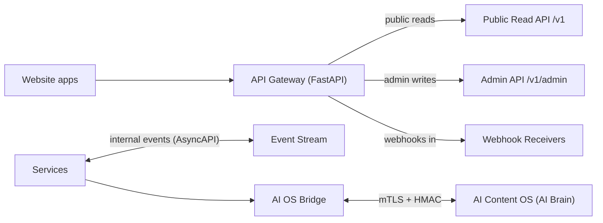

# 12 — API Contracts (Permanent API Contract Specification)

**Status:** Frozen — binding for all future implementation
**Version:** 1.0
**Compliance:** Must satisfy the [Website Architecture Contract](09-website-architecture-contract.md), the [Technology Stack](10-technology-stack.md), and the [Database Blueprint](11-database-architecture.md)

This document **freezes the language** between the website and the Universal AI Content Operating System (AI OS), and defines every API, webhook, and event contract of the business layer. It is the permanent contract registry.

> **The locked rule:** The website **never** calls Gemini, OpenAI, Claude, or any other model/LLM API directly. The only path is:
>
> Website → AI OS Bridge → Universal AI Content Operating System

---

## 1. Purpose and scope

- Define what the website requests from the AI OS, and what the AI OS delivers back.
- Define **when** the website calls the AI OS and **when it never does**.
- Define error handling, authentication, versioning, rate limits, retry policy, idempotency, event contracts, and webhook contracts.
- Provide a registry reusable by future surfaces: mobile app, desktop app, and other websites (via the public read API).
- Replace the provisional names in `05-api-flow.md` with the frozen contract registry.

## 2. Contract principles

1. **One door.** All AI OS traffic passes through the AI OS Bridge; no other component holds AI OS credentials or makes AI OS calls.
2. **Contract-first.** Every contract is versioned, schema-defined, and reviewed in `libs/contracts/`.
3. **AI OS is optional in the request path.** No reader-facing request ever waits on the AI OS. The website degrades gracefully when the AI OS is unavailable.
4. **The website is a consumer, never a producer of intelligence.** Contracts carry requests, references, and approved outputs — never prompts, model internals, or learning data.
5. **Everything is idempotent or deduplicated.** Retries are always safe.
6. **Backwards-compatible by default.** Additive changes are the norm; breaking changes require a major version and a deprecation window.

## 3. API surface map

## 4. Authentication

| Surface | Method | Details |
|---------|--------|---------|
| AI OS Bridge (out) | mTLS mutual TLS + HMAC-SHA256 payload signature | Certificates and keys from Vault; per-environment rotation; replay window ≤ 5 min |
| AI OS Bridge (in) | HMAC-SHA256 signature header + timestamp + nonce | `X-AIOS-Signature`, `X-AIOS-Timestamp`, `X-AIOS-Nonce`; verified before any processing |
| Public Read API | Read-only; cacheable; optional signed URLs | No credentials on public content; signed URLs for restricted content |
| Admin API | OIDC access token (JWT) | RBAC claims, MFA required; audit-logged |
| Webhooks (Pinterest/networks) | HMAC-SHA256 per source secret | Secret refs in Vault; nonce + event-ID replay protection |

**Rules:** credentials never appear in URLs, logs, or payloads; every credential lives in Vault; every secret read is audited.

## 5. Versioning policy

- **URIs:** versioned by path: `/api/v1/...`, `/webhooks/v1/...`, contracts versioned `v1`, `v2`, …
- **Semantic versioning** for contracts: additive changes (new optional fields) are backwards-compatible; breaking changes (removed/renamed/required fields) require a major version.
- **Deprecation window:** a deprecated major version remains available ≥ 2 releases with `Deprecation` headers before removal.
- **Event schemas:** versioned inside the event envelope (`type.v1`, `type.v2`); consumers tolerate unknown optional fields.
- **Registry:** all versions are tracked in Section 14; a new version requires an ADR.

## 6. Common envelope and error model

All API responses use a consistent envelope; all errors use RFC 7807 (`problem+json`):

| Field | Meaning |
|-------|---------|
| `type` | Stable error type URI |
| `title` | Short human-readable summary |
| `status` | HTTP status code |
| `code` | Stable machine code (e.g., `RATE_LIMITED`) |
| `detail` | Human-readable explanation |
| `instance` | Request/trace identifier |
| `retryable` | Whether retrying is safe/effective |

**Stable error codes (global):**

| Code | HTTP | Meaning | Retryable |
|------|------|---------|-----------|
| `VALIDATION_FAILED` | 400 | Schema/field error | No |
| `UNAUTHENTICATED` | 401 | Missing/invalid credentials | No |
| `FORBIDDEN` | 403 | Not permitted | No |
| `NOT_FOUND` | 404 | Entity/context unknown | No |
| `DUPLICATE` | 409 | Idempotency/unique conflict | No (resume with same key) |
| `UNSUPPORTED_NICHE` | 422 | Niche not active/registered | No |
| `RATE_LIMITED` | 429 | Budget exhausted | Yes — respect `Retry-After` |
| `INTERNAL_ERROR` | 500 | Unexpected | Yes (with backoff) |
| `SERVICE_UNAVAILABLE` | 503 | Dependency (incl. AI OS) down | Yes |
| `TIMEOUT` | 504 | Upstream deadline exceeded | Yes |

## 7. Rate limits

| Surface | Default budget | Over-limit behavior |
|---------|----------------|----------------------|
| Public Read API | Per-IP + per-key; burst vs sustained | `429` + `Retry-After`; edge-level enforcement |
| Admin API | Per-user per-minute | `429` + `Retry-After`; alert on abuse |
| AI OS Bridge (out) | Per niche per hour, per contract (e.g., pin assets ≤ 100/h/niche) | Local budget gate before sending; queue, never block readers |
| AI OS Bridge (in) | Per contract per hour | Reject burst with `429`; log in `webhook_logs` |
| Webhooks (in) | Per source; burst + daily cap | Drop-and-dead-letter; alert |

**Rule:** the website's own rate budgets are configured per Pinterest account and per niche; the AI OS bridge budget is enforced in the bridge before any call leaves the platform.

## 8. Retry policy

1. **Exponential backoff with jitter:** base 1 s, factor 2, cap 60 s, max 5 attempts.
2. **`429`:** always respect `Retry-After`; do not backoff-and-pile.
3. **Non-retryable errors** (`VALIDATION_FAILED`, `FORBIDDEN`, `DUPLICATE`, `UNSUPPORTED_NICHE`): no retry; surface the error to the initiating workflow.
4. **Circuit breaker:** after ≥ 50% failures in a 60 s window, open the breaker for 60 s; the website continues normal operation without AI OS work; jobs stay queued (`aios_job_records`, `queue_items`).
5. **Retries are safe by design:** every request carries `request_id`/`Idempotency-Key`; every event carries `event_id`; duplicates are deduplicated at the consumer.

## 9. Idempotency

| Surface | Key | Behavior |
|---------|-----|----------|
| AI OS Bridge requests | `request_id` (UUID) | Duplicate `request_id` returns the original `job_id` (200/202) — no re-execution |
| AI OS content intake | `content_package_id` + `checksum` | Duplicate package rejected with `DUPLICATE` (409) or returns existing `intake_id` |
| Admin writes | `Idempotency-Key` header | Gateway stores key + response for the TTL; retries return the stored response |
| Webhooks/events | `event_id` + `source` | Deduplicated at the receiver (`UNIQUE (source, event_id)` in `webhook_logs`) |

## 10. Webhook contracts (inbound)

**Delivery model:** at-least-once, fast-ack (HTTP 202 immediately), async processing, dedupe by `event_id`, dead-letter after N failures, replay endpoint per source.

**Common webhook envelope:** `{ event_id, type, version, source, occurred_at, nonce, payload }` + `X-Webhook-Signature` header (HMAC-SHA256 of the raw body, per-source secret).

| Webhook | Source → Website | Payload highlights | Processing |
|---------|------------------|--------------------|------------|
| `pinterest.pin.created` | Pinterest API | `pin_id`, account, board, permalink | Sync pin ledger, attribution, analytics |
| `pinterest.pin.deleted` | Pinterest API | `pin_id` | Mark pin deleted; analytics |
| `network.conversion` | Affiliate network | `transaction_id`, click token, amount, status | Verify signature; dedupe; write `revenue_transactions`; reconcile |
| `aios.job.status` | AI OS | `job_id`, `request_id`, state, `result_ref`, errors | Verify signature; update `aios_job_records`; dispatch results to services |
| `aios.content.intake` | AI OS | `content_package_id`, niche, content type, refs | Verify; validate; dedupe; store; publish event |

## 11. Event contracts (internal, AsyncAPI)

Envelope: `{ event_id, type, version, niche_id, pinterest_account_id?, occurred_at, producer, payload }`. Events are the integration glue between services; consumers are tolerant of additive changes.

| Event | Producer | Consumers | Payload highlights |
|-------|----------|-----------|--------------------|
| `content:published.v1` | Content service | Search, SEO, renderer, analytics, Redis invalidation | article_id, niche_id, url, checksum |
| `content:updated.v1` / `content:unpublished.v1` | Content service | Same | article_id, niche_id |
| `pin:scheduled.v1` | Pinterest service | Queue workers | pin_id, account_id, niche_id, run_at |
| `pin:published.v1` / `pin:failed.v1` | Pinterest service | Analytics, attribution | pin_id, account_id, remote_pin_id |
| `product:ingested.v1` / `product:removed.v1` | Affiliate service | Search, SEO, analytics | product_id, niche_id, checksum |
| `affiliate:click.v1` | Affiliate service | Analytics warehouse | click_id, link_token_id, niche_id |
| `revenue:attributed.v1` | Affiliate service | Analytics, read models | transaction_id, niche_id, amount |
| `seo:sitemap-rebuilt.v1` | SEO service | CDN purge, analytics | niche_id, shard_count |
| `aios:job-completed.v1` | AI OS Bridge | Requesting services | job_id, contract, result_ref |

---

## 12. AI OS Bridge contracts (the frozen core)

All six contracts below are the **only** AI OS communication allowed. Version: `v1` at freeze.

### 12.1 `AIOS.Content.Intake` (AI OS → Website)

- **Purpose:** AI OS delivers approved content packages (articles, product descriptions) for the website to store and publish.
- **Direction:** AI OS → Bridge → Content Service.
- **Trigger (when called):** AI OS finishes producing an approved content package for an accepted job; also push-only when the website requested content via a job.
- **Never called when:** the website is rendering, serving, or linking — content is already stored by then.

| Request field | Type | Req | Notes |
|---------------|------|-----|-------|
| `content_package_id` | UUID | yes | Idempotency + dedupe key |
| `niche_id` | UUID | yes | Must be active |
| `content_type` | enum | yes | `article` \| `product_description` |
| `job_id` | UUID | no | Originating job |
| `title`, `slug_suggestion` | string | yes | SEO-relevant |
| `body_ref` | string | yes | Object-storage reference (never inline body) |
| `media_refs[]` | string[] | no | Approved image refs |
| `seo` | object | yes | Title, meta description, keywords (already produced by AI OS) |
| `publish_preferences` | object | no | Schedule, niche placement |
| `checksum` | string | yes | Content hash for dedupe |

- **Response:** `202 Accepted { intake_id, status: "stored" }`; duplicates return existing `intake_id` (200).
- **Errors:** `VALIDATION_FAILED`, `UNAUTHENTICATED`, `DUPLICATE`, `UNSUPPORTED_NICHE`, `RATE_LIMITED`, `SERVICE_UNAVAILABLE`.
- **Policies:** dedupe by `(content_package_id, checksum)`; rate per niche/hour; retryable 5xx with backoff.

### 12.2 `AIOS.Job.Request` (Website → AI OS)

- **Purpose:** The website requests generation work (pin assets, SEO metadata, insights, content) — it never generates anything itself.
- **Direction:** Bridge → AI OS.
- **Trigger (when called):** pin asset need (scheduled pin without assets), new URL needing SEO metadata, scheduled insights refresh, approved content request.
- **Never called when:** any reader-facing request; any pure business operation (analytics, revenue, admin, auth, search, rendering).

| Request field | Type | Req | Notes |
|---------------|------|-----|-------|
| `request_id` | UUID | yes | Idempotency |
| `job_type` | enum | yes | `content` \| `seo_metadata` \| `pinterest_assets` \| `analytics_insights` |
| `niche_id` | UUID | yes | Scoping |
| `context` | object | yes | E.g., pin_id, article_id/url, period for insights |
| `preferences` | object | no | Niche/brand/format hints |
| `callback` | object | yes | Webhook target + event contract for results |

- **Response:** `202 Accepted { job_id }`.
- **Errors:** `VALIDATION_FAILED`, `UNAUTHENTICATED`, `NOT_FOUND` (bad context), `DUPLICATE` (same `request_id`), `RATE_LIMITED`, `SERVICE_UNAVAILABLE` (AI OS busy — queue, don't fail the business flow).
- **Policies:** idempotent by `request_id`; per-niche-per-hour budget; job status arrives via `aios.job.status` webhook.

### 12.3 `AIOS.Job.Status` (AI OS → Website, webhook)

- **Purpose:** AI OS reports job lifecycle: queued, running, succeeded, failed, canceled.
- **Direction:** AI OS → Bridge (webhook `aios.job.status`).
- **Trigger (when called):** job state changes after a `AIOS.Job.Request`.
- **Never called when:** no job exists; heartbeat only (`AIOS.Heartbeat`).

| Field | Type | Req | Notes |
|-------|------|-----|-------|
| `job_id` | UUID | yes | Correlation |
| `request_id` | UUID | yes | Original request |
| `state` | enum | yes | `queued` \| `running` \| `succeeded` \| `failed` \| `canceled` |
| `progress` | float | no | 0–1 |
| `result_ref` | string | no | Approved output reference (e.g., content package, assets) |
| `error_code` | string | no | Machine-readable failure reason |

- **Delivery:** at-least-once; dedupe by `(job_id, event_seq)`; retry with backoff; dead-letter after failures.
- **Website behavior:** updates `aios_job_records`; dispatches `result_ref` to the requesting service; never blocks.

### 12.4 `AIOS.SEO.Metadata` (AI OS → Website)

- **Purpose:** AI OS delivers SEO metadata intelligence for URLs; the website applies it as business data.
- **Direction:** delivered as the result of a `seo_metadata` job via `aios.job.status`.
- **Trigger (when called):** after a `AIOS.Job.Request` for a new/updated URL; or proactively when AI OS completes an approved metadata job.
- **Never called when:** the website computes or decides SEO content itself; metadata application (tags, sitemaps, JSON-LD) is website work, intelligence is AI OS work.

| Field | Type | Req | Notes |
|-------|------|-----|-------|
| `job_id`, `url_registry_id` | UUID | yes | Correlation + target |
| `title`, `meta_description` | string | yes | Approved metadata |
| `canonical_suggestion` | string | no | URL policy input (website validates) |
| `keywords[]` | string[] | no | Applied to SEO service, not stored as intelligence |
| `structured_data_hints` | object | no | JSON-LD hints (website validates schema) |
| `confidence` | float | no | Display/decision hint only |

- **Website role:** validate, apply, publish (sitemap/JSON-LD), track in `seo_metadata`; the website remains the owner of SEO *output*.

### 12.5 `AIOS.Pinterest.Assets` (AI OS → Website)

- **Purpose:** AI OS delivers generated pin images and copy variants for scheduled pins.
- **Direction:** result of a `pinterest_assets` job via `aios.job.status` (or with content intake for article-linked pins).
- **Trigger (when called):** the Pinterest service needs assets for a scheduled pin and none exist.
- **Never called when:** publishing the pin (website work); tracking/attribution (website work); asset storage (website object storage).

| Field | Type | Req | Notes |
|-------|------|-----|-------|
| `job_id`, `pin_draft_id` | UUID | yes | Correlation |
| `assets[]` | array | yes | `{ image_ref, copy, title, board_suggestion }` per variant |
| `status` | enum | yes | `ready` \| `partial` \| `failed` |

- **Website role:** store asset refs in object storage + `media`/`pin_queue_items`; schedule and publish via the Pinterest API; never generates images or copy.

### 12.6 `AIOS.Analytics.Insights` (AI OS → Website)

- **Purpose:** AI OS returns insights/recommendations over website-provided metrics; the website displays them read-only.
- **Direction:** result of an `analytics_insights` job; triggered on a schedule (e.g., weekly) or on demand from the admin dashboard.
- **Trigger (when called):** scheduled insight refresh; admin requests an insight report.
- **Never called when:** computing metrics (website work), revenue decisions, automated actions from insights (humans decide).

| Field | Type | Req | Notes |
|-------|------|-----|-------|
| `job_id`, `niche_id` | UUID | yes | Correlation + scope |
| `period` | string | yes | Covered period |
| `insight_bundle` | object | yes | Headlines, findings, recommendations (display-only) |
| `display_flags` | object | no | How the dashboard may render it (no executable actions) |

- **Website role:** store as `kpi_snapshots` payloads; render in dashboards with an "AI OS insights" label; never auto-acts on them.

### 12.7 `AIOS.Heartbeat` (AI OS ↔ Website)

- **Purpose:** Liveness/connectivity between Bridge and AI OS.
- **Trigger:** every 60 s from either side when idle.
- **Response:** `200 { status: "ok", latency_ms }`.
- **Never:** carries business data; used only for observability (dashboard alert if missing).

## 13. When the website calls the AI OS — and when it never does

### Calls the AI OS (only via Bridge, only these triggers)

| Trigger | Contract |
|---------|----------|
| Scheduled pin lacks generated assets | `AIOS.Job.Request` (pinterest_assets) |
| New/updated URL needs SEO metadata | `AIOS.Job.Request` (seo_metadata) |
| Approved request for content (article/product copy) | `AIOS.Job.Request` (content) |
| Weekly/on-demand insights refresh | `AIOS.Job.Request` (analytics_insights) |
| Receiving results/callbacks | `AIOS.Job.Status`, `AIOS.Content.Intake`, `AIOS.SEO.Metadata`, `AIOS.Pinterest.Assets`, `AIOS.Analytics.Insights` |
| Idle connectivity check | `AIOS.Heartbeat` |

### Never calls the AI OS

- **Never during a reader request** (rendering, serving, search, link resolution).
- **Never for business computation**: analytics, revenue, attribution, SEO output production (sitemaps/JSON-LD application), admin operations, auth, notifications.
- **Never directly**: no model SDK, no LLM call, no Gemini/OpenAI/Claude/any provider, from any app or service.
- **Never for stored intelligence**: no prompt storage, no model routing, no embeddings/vectors in the database (Database Blueprint §16).
- **Never without the Bridge**: no other component may hold AI OS credentials or endpoints.

## 14. Contract registry

| Contract | Direction | Version | Status | Owner | Lifecycle |
|----------|-----------|---------|--------|-------|-----------|
| Public Read API | Client ↔ Website | v1 | Frozen | `@atoz/platform` | Reusable by mobile/desktop/other sites |
| Admin API | Admin app ↔ Website | v1 | Frozen | `@atoz/governance` | Internal |
| Webhook receivers | Pinterest/networks/AI OS → Website | v1 | Frozen | `@atoz/platform` | Internal |
| Internal events (AsyncAPI) | Service ↔ Service | v1 | Frozen | `@atoz/lead` | Internal |
| `AIOS.Content.Intake` | AI OS → Website | v1 | Frozen | `@atoz/bridge` | Bridge-only |
| `AIOS.Job.Request` | Website → AI OS | v1 | Frozen | `@atoz/bridge` | Bridge-only |
| `AIOS.Job.Status` | AI OS → Website | v1 | Frozen | `@atoz/bridge` | Bridge-only |
| `AIOS.SEO.Metadata` | AI OS → Website | v1 | Frozen | `@atoz/bridge` | Bridge-only |
| `AIOS.Pinterest.Assets` | AI OS → Website | v1 | Frozen | `@atoz/bridge` | Bridge-only |
| `AIOS.Analytics.Insights` | AI OS → Website | v1 | Frozen | `@atoz/bridge` | Bridge-only |
| `AIOS.Heartbeat` | AI OS ↔ Website | v1 | Frozen | `@atoz/bridge` | Bridge-only |

**Future reuse:** the Public Read API is the reuse surface for the mobile app, desktop app, and other websites — same contracts, same versioning. The AI OS Bridge contracts are platform-internal; other websites consume business data through the Public Read API, never through the Bridge.

## 15. Boundary verification

1. The only AI OS references in code are inside `services/aios-bridge/` and `libs/contracts/aios/`.
2. CI dependency scanning rejects any LLM/model/agent SDK in any manifest (Technology Stack §13).
3. No AI OS contract may be called outside the Bridge; review enforces this on every PR.
4. The website functions fully without the AI OS: queued jobs wait; readers never see the difference.

## 16. Change process

- This registry is **frozen**. Any contract change requires an ADR, a contract-compliance review, a `CHANGELOG.md` entry, and approval by `@atoz/lead` (Bridge contracts also by `@atoz/bridge`).
- A change that opens a direct AI call path is rejected outright under the Website Architecture Contract §1 and §5.
