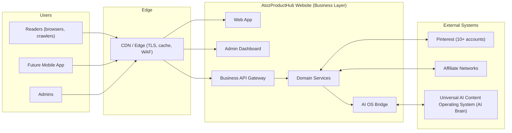

# AtozProductHub Website — Architecture

**Document version:** 0.1 (baseline)
**Type:** Architecture and documentation only — no implementation
**Owner:** Lead Software Architect

> **Contract:** [09-website-architecture-contract.md](09-website-architecture-contract.md) is the binding boundary document. No implementation may begin until it is ratified.

This document set defines the complete architecture of the AtozProductHub website. The website is **only the business layer** of the AtozProductHub platform. The **Universal AI Content Operating System (AI OS)** already exists as the AI Brain and remains a completely separate system, codebase, and repository. Nothing in this architecture duplicates, reimplements, or embeds AI OS functionality.

## 1. Purpose

- Establish a single source of truth for how the website is designed, layered, and scaled.
- Define the boundaries between the website (business layer) and the AI OS (AI Brain).
- Give every future engineer, reviewer, and contributor the same mental model before any code exists.
- Provide the basis for scope and design documents required before implementation (see the "Docs before code" rule in the root `README.md`).

## 2. Scope

### In scope
Website, articles, affiliate products, Pinterest, SEO, traffic, revenue, analytics, automation, admin dashboard, and the future mobile app surface.

### Out of scope
AI content generation, model orchestration, content intelligence, prompt engineering, and every other capability owned by the AI OS. The website integrates with the AI OS **only** through the AI OS Bridge, a single documented integration boundary.

## 3. Design principles

1. **Business layer only.** The website sells, measures, publishes, and operates. The AI Brain thinks. Neither side does the other's job.
2. **Niche-first tenancy.** Every entity and every event is scoped to a niche (business tenant). This is what makes multiple niches and ten Pinterest accounts manageable.
3. **CDN-first content.** Content is written once, validated, stored immutably, and rendered to static, cacheable artifacts. Dynamic computation stays out of the reader's request path.
4. **Events over calls.** Anything that is not part of the immediate user request is handled asynchronously through a versioned event stream (pins, analytics, sitemaps, reporting).
5. **Contract-first integration.** All internal and external communication uses versioned contracts (OpenAPI/AsyncAPI). No ad-hoc couplings.
6. **Own your data.** Each module owns its schema and its store. No shared tables, no cross-module database reads.
7. **Boring technology.** Simple, well-supported, mainstream tools. Novelty is a review blocker.
8. **Security and privacy by design.** Least privilege, no secrets in code, minimal data collection, full affiliate disclosure, and consent compliance are architecture requirements, not afterthoughts.
9. **No duplicate features.** Anything the AI OS already does is integrated, never rebuilt. See the policy in the root `README.md`.

## 4. System context

Readers, crawlers, and the future mobile app reach the website through the CDN edge. The website reaches the AI OS **only** through the AI OS Bridge. Pinterest and affiliate networks are reached only through their respective service adapters.

## 5. Layer summary

| # | Layer | Purpose | Key modules | AI OS contact |
|---|-------|---------|-------------|---------------|
| L0 | Edge & CDN | Fast, protected delivery of content to readers | CDN, WAF, edge cache | None (indirect via content) |
| L1 | Presentation | Render the website, admin, and future mobile surfaces | Web app, Admin app | None (reads published output) |
| L2 | API Gateway | Expose and orchestrate business capabilities | Public API, Admin API, webhooks | Receives AI OS content intake & callbacks |
| L3 | Domain Services | Enforce business rules per bounded context | Content, Pinterest, Affiliate, SEO, Analytics, Admin | Consumes AI OS outputs via Bridge |
| L4 | Integration | Talk to external systems | AI OS Bridge, Pinterest adapter, affiliate adapters | **The only AI OS contact point** |
| L5 | Data Layer | Persist, search, and serve data | Stores, object storage, search, events, warehouse | None (stores outputs only) |
| L6 | Infrastructure | Run and observe the platform | IaC, CI/CD, observability, secrets | None |

## 6. Scale targets and design responses

| Capability | Target | Design response |
|------------|--------|-----------------|
| Pinterest accounts | 10+ accounts | One account record per niche; per-account token vault entries, rate-limit budgets, and publish queues |
| Niches | Multiple | `niche_id` context on every entity, event, and report; per-niche configuration and rendering |
| Articles | Millions | Immutable content store + static rendering + CDN; sharded sitemaps; search index built from events |
| Pins | Millions | Append-only pin ledger, partition by account/date, queue-based publishing, attribution via pin URL params |
| Affiliate products | Full catalog | Catalog service with feed ingestion, link tokens, click attribution, and commission ledger |
| Mobile app | Future | Public read API + CDN + signed URLs; no business logic in the client |

## 7. Document index

| Document | Covers |
|----------|--------|
| [01-folder-structure.md](01-folder-structure.md) | Planned repository layout, conventions, responsibility mapping |
| [02-system-layers.md](02-system-layers.md) | The seven layers with purpose, ownership, and boundaries |
| [03-module-boundaries.md](03-module-boundaries.md) | Bounded contexts, what each owns/never owns, dependencies |
| [04-data-flow.md](04-data-flow.md) | Content, pin, affiliate, analytics, and admin data flows |
| [05-api-flow.md](05-api-flow.md) | API classes, contracts, sequence flows, governance |
| [06-responsibilities.md](06-responsibilities.md) | Website, Pinterest, affiliate, SEO, analytics, admin responsibilities |
| [07-security-boundaries.md](07-security-boundaries.md) | Trust zones, threat model, secrets, compliance |
| [08-deployment-strategy.md](08-deployment-strategy.md) | Environments, CI/CD, rollout, scaling, DR |
| [09-website-architecture-contract.md](09-website-architecture-contract.md) | **Binding contract:** locked boundary, closed loop, prohibitions, amendment process |

## 8. Conventions used in this document set

- Diagrams are Mermaid where flow is best shown; ASCII is used where a simple sketch reads better.
- **AI OS API names are provisional** (e.g., `AIOS.Content.Intake`). They must be mapped to the existing AI OS contracts during integration design; the *semantics* are the architecture, the names are placeholders.
- "Never owns" statements are hard rules, not preferences. They exist to protect the boundary with the AI OS and to keep modules decoupled.
- Every flow in this document set is implementation-agnostic: no framework, language, or service vendor is chosen by the architecture.
