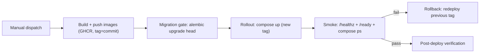

# 004 — Deployment & Rollback (M11 Phase F)

- **Date:** 2026-08-14
- **Owner:** @atoz/platform
- **Workflow:** `.github/workflows/deploy.yml` (manual dispatch: staging | prod)

## 1. Environments

| Environment | Purpose | Data | Promotion |
|---|---|---|---|
| staging | Integration + load tests + restore drills | Anonymized snapshot | Manual dispatch |
| prod | Readers and operators | Production | Manual dispatch after staging green |

Both environments run the same `infra/docker/compose.prod.yml`; only the
`.env` (injected from Vault, provisioned on the runner) differs.

## 2. Deployment workflow

1. **Build + push** — every first-party image is built and pushed to GHCR
   with a commit-sha tag and `latest`.
2. **Migration gate** — `alembic upgrade head` runs against the target
   database *before* the app rollout, inside a disposable container, so a
   schema change can never race the new code.
3. **Rollout** — compose deploys the new tag (`--no-deps --pull always`).
4. **Smoke** — `/healthz` on the edge and `/ready` on services must pass
   before the deploy is considered green.
5. **Post-deploy verification** — `compose ps` state + SLO dashboard check.

## 3. Rollback

- Stateless services roll back by redeploying the previous image tag
  (`docker compose up -d` with the prior tag — the workflow's
  `Rollback on failure` step).
- **Database dependency handling:** migrations are additive and
  rollback-safe by policy; the previous image is forward-compatible with
  the migrated schema. Destructive schema changes require an explicit
  release window and a documented reverse migration.
- **Ledger safety:** queue items and job runs live in Postgres (ADR-0010),
  so a rollback never loses execution state; workers re-claim due work on
  the next Beat tick.

## 4. Activation prerequisites (Phase F infrastructure)

- Self-hosted runner tagged `deploy` with Docker Compose and the repo
  checked out at `/opt/atozproducthub`.
- Repository secrets: `DEPLOY_HOST`, `DEPLOY_SSH_USER`, `DEPLOY_SSH_KEY`,
  `DEPLOY_ENV_FILE` (base64 `.env.prod`), `DATABASE_URL`.
- Environment protection rules: `prod` requires manual approval.

Until the runner + secrets exist, the workflow is scaffolded and disabled
(manual dispatch only); CI remains the deployment safety net.
