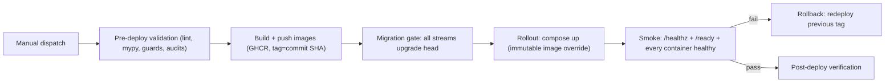

# 004 — Deployment & Rollback (M11 Phase F)

- **Date:** 2026-08-14
- **Owner:** @atoz/platform
- **Workflow:** `.github/workflows/deploy.yml` (manual dispatch: staging | prod)
- **Phase 3:** `tools/deploy/run-migration-gate.sh` (all streams),
  `tools/deploy/write-image-override.sh` (immutable GHCR tag pin),
  `tools/deploy/staging-smoke.sh` (fail-closed), `tools/deploy/rollback-test.sh`
  (staging rollback drill)

## 1. Environments

| Environment | Purpose | Data | Promotion |
|---|---|---|---|
| staging | Integration + load tests + restore drills | Anonymized snapshot | Manual dispatch |
| prod | Readers and operators | Production | Manual dispatch after staging green |

Both environments run `infra/docker/compose.prod.yml` plus the staging
identity overlay (`infra/docker/compose.staging.yml` — same file for both;
the env file selects the real domains/CORS). Only the `.env` (injected
from Vault, provisioned on the runner) differs.

## 2. Deployment workflow

1. **Validate** — ruff, mypy, every guard (no-AI, contracts, infra,
   staging, observability, security), pip-audit, npm audit, and `docker
   compose config -q` for prod + staging must pass before any image is
   built.
2. **Build + push** — every first-party image is built and pushed to GHCR
   with a commit-sha tag and `latest`.
3. **Migration gate** — `tools/deploy/run-migration-gate.sh` runs
   `alembic upgrade head` for all seven streams against the target
   database *before* the app rollout, inside disposable containers.
4. **Rollout** — `tools/deploy/write-image-override.sh` generates the
   transient `compose.images.yml` pinning every first-party service to the
   immutable tag; compose deploys with `--no-deps --pull always`.
5. **Smoke** — `tools/deploy/staging-smoke.sh` checks the edge
   (`/healthz`, `/health`, `/ready`) and every required container is
   healthy; any failure fails the run (fail-closed).
6. **Post-deploy verification** — `compose ps` state + SLO dashboard check.

## 3. Rollback

- Stateless services roll back by redeploying the previous image tag
  (`compose.images.yml` regenerated with the previous tag — the workflow's
  `Rollback on failure` step reads `/opt/atozproducthub/.last-deployed-tag`).
- **Database dependency handling:** migrations are additive and
  rollback-safe by policy; the previous image is forward-compatible with
  the migrated schema. Destructive schema changes require an explicit
  release window and a documented reverse migration. **Rollback never
  downgrades the database automatically.**
- **Unsafe DB rollback cases (documented):** destructive migrations
  (drop column/table, data backfill that cannot be reversed), constraint
  changes that reject old writes, and partition repartitioning all require
  a forward-compatible migration or a planned reverse migration in a
  release window — never an automatic rollback.
- **Ledger safety:** queue items, job runs, and idempotency keys live in
  Postgres (ADR-0010), so a rollback never loses execution state; workers
  re-claim due work on the next Beat tick.

## 4. Staging rollback drill (M11 Phase 3, ADR-0014)

`tools/deploy/rollback-test.sh` exercises the full cycle on the staging
host: deploy N, verify health; deploy N+1, verify health; inject a
controlled failure; roll back to N; verify every service healthy, DB
compatibility (no auto-downgrade), automation-run idempotency keys intact,
and row-count spot checks on `articles`, `affiliate_links`,
`pinterest_pins`, and `url_registry`. Run it via the workflow input
`run_rollback_test: true` (staging only) or directly on the host.

## 4. Activation prerequisites (Phase F infrastructure)

- Self-hosted runner tagged `deploy` with Docker Compose and the repo
  checked out at `/opt/atozproducthub`.
- Repository secrets: `DEPLOY_HOST`, `DEPLOY_SSH_USER`, `DEPLOY_SSH_KEY`,
  `DEPLOY_ENV_FILE` (base64 `.env.prod`), `DATABASE_URL`.
- Environment protection rules: `prod` requires manual approval.
- Staging identity overlay + generated image override are validated by
  `tools/dev/check-staging.sh` and the deploy `validate` job.

Until the runner + secrets exist, the workflow is scaffolded and disabled
(manual dispatch only); CI remains the deployment safety net.
